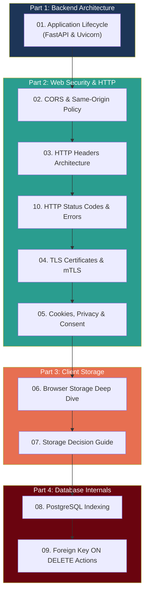

# 📚 SkyNest Engineering Learning Series

Welcome to the **SkyNest Engineering & Architecture Learning Series**. This collection of comprehensive guides covers backend internals, web security, browser architectures, and database design principles — using practical scenarios and examples from the **SkyNest Hotel Management System**.

---

## 🗺️ Curriculum Overview

---

## 📖 Module Directory

### Part 1: Backend Architecture & Lifecycle

| # | Guide | Core Concepts Covered |
| :---: | :--- | :--- |
| **01** | [**Application Lifecycle & Lifespan Pattern**](./01_application_lifecycle.md) | FastAPI lifespan context managers, `@asynccontextmanager`, startup/shutdown sequencing, database connection pool lifecycle, avoiding connection leaks, graceful shutdown. |

---

### Part 2: Web Security & HTTP Architecture

| # | Guide | Core Concepts Covered |
| :---: | :--- | :--- |
| **02** | [**CORS & Same-Origin Policy**](./02_cors_and_same_origin_policy.md) | Origin tuple definition (Scheme + Host + Port), Same-Origin Policy security boundaries, Cross-Origin Resource Sharing, simple vs. preflight `OPTIONS` requests, credentialed CORS rules. |
| **03** | [**HTTP Headers Architecture**](./03_http_headers.md) | Complete taxonomy of HTTP headers: Content Negotiation, Client Context, Security/Authentication, Caching, Tracing (`X-Request-ID`), request vs. response lifecycles. |
| **04** | [**TLS Certificates, PKI & Mutual TLS**](./04_tls_certificates.md) | Transport Layer Security, X.509 cryptographic structure, Certificate Authorities and Public Key Infrastructure trust chains, One-way TLS vs. Mutual TLS (mTLS). |
| **05** | [**Cookies, Privacy Laws & Consent Banners**](./05_cookies_and_consent.md) | HTTP-level cookie exchange, security attributes (`HttpOnly`, `Secure`, `SameSite`), Session vs. Persistent cookies, GDPR/ePrivacy compliance, 4 cookie categories, consent workflows. |
| **10** | [**HTTP Status Codes & Error Architecture**](./10_http_status_codes_and_errors.md) | Standard HTTP status code taxonomy (2xx, 4xx, 5xx), the Core 6 error codes (400, 401, 403, 404, 409, 422), complete SkyNest error matrix, frontend interception. |

---

### Part 3: Client-Side Browser Storage

| # | Guide | Core Concepts Covered |
| :---: | :--- | :--- |
| **06** | [**Browser Storage Mechanisms (Deep Dive)**](./06_browser_storage.md) | In-depth examination of `localStorage`, `sessionStorage`, Cookies, and `IndexedDB`. Internal database engines (LevelDB, SQLite), disk filesystem locations on Windows, DevTools inspection. |
| **07** | [**Storage Comparison & Decision Guide**](./07_storage_comparison.md) | Head-to-head comparisons (Persistent Cookies vs. `localStorage`, Session Cookies vs. `sessionStorage`), Master Comparison Table, Architectural Decision Flowchart, XSS/CSRF threat modeling. |

---

### Part 4: Database Fundamentals & Relational Design

| # | Guide | Core Concepts Covered |
| :---: | :--- | :--- |
| **08** | [**PostgreSQL Indexing Fundamentals**](./08_database_indexing.md) | Heap storage vs. index storage, B-Tree internals and balanced node traversal, Sequential Scan vs. Index Scan execution paths, indexing write penalty, composite index column ordering. |
| **09** | [**PostgreSQL Foreign Key ON DELETE Actions**](./09_foreign_key_actions.md) | Relational integrity rules, the five `ON DELETE` behaviors (`RESTRICT`, `CASCADE`, `SET NULL`, `NO ACTION`, `SET DEFAULT`), SkyNest line-by-line foreign key rationale, cascading delete flows. |

---

## 🎯 Recommended Reading Tracks

Depending on your role or learning focus, consider these curated sequences:

### Track A: Full-Stack Developer (Recommended)
1. [`01_application_lifecycle.md`](./01_application_lifecycle.md) → Understand server initialization
2. [`02_cors_and_same_origin_policy.md`](./02_cors_and_same_origin_policy.md) → Connect Vite frontend to FastAPI backend
3. [`03_http_headers.md`](./03_http_headers.md) → Master API communication protocols
4. [`10_http_status_codes_and_errors.md`](./10_http_status_codes_and_errors.md) → Handle REST error responses and status codes
5. [`05_cookies_and_consent.md`](./05_cookies_and_consent.md) → Implement secure session handling
6. [`06_browser_storage.md`](./06_browser_storage.md) & [`07_storage_comparison.md`](./07_storage_comparison.md) → Manage client-side cache and tokens
7. [`08_database_indexing.md`](./08_database_indexing.md) & [`09_foreign_key_actions.md`](./09_foreign_key_actions.md) → Optimize queries and enforce schema safety

### Track B: Security & Infrastructure
1. [`04_tls_certificates.md`](./04_tls_certificates.md) → Certificate chains, HTTPS, and mTLS
2. [`02_cors_and_same_origin_policy.md`](./02_cors_and_same_origin_policy.md) → Cross-origin boundaries
3. [`05_cookies_and_consent.md`](./05_cookies_and_consent.md) → Privacy laws, GDPR, and cookie security flags
4. [`07_storage_comparison.md`](./07_storage_comparison.md) → XSS and token storage risk assessment

### Track C: Database Engineer / DBA
1. [`08_database_indexing.md`](./08_database_indexing.md) → B-Tree internals, index selectivity, query cost reduction
2. [`09_foreign_key_actions.md`](./09_foreign_key_actions.md) → Referential integrity, orphan prevention, cascading logic
3. [`01_application_lifecycle.md`](./01_application_lifecycle.md) → Connection pooling and graceful pool shutdown
