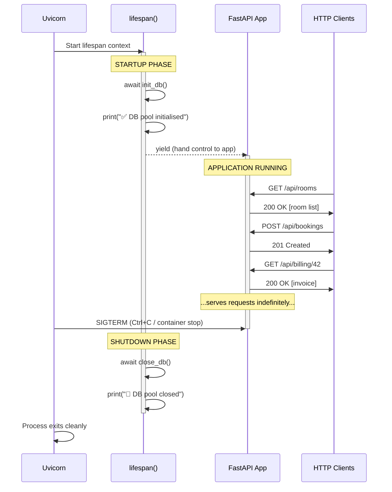
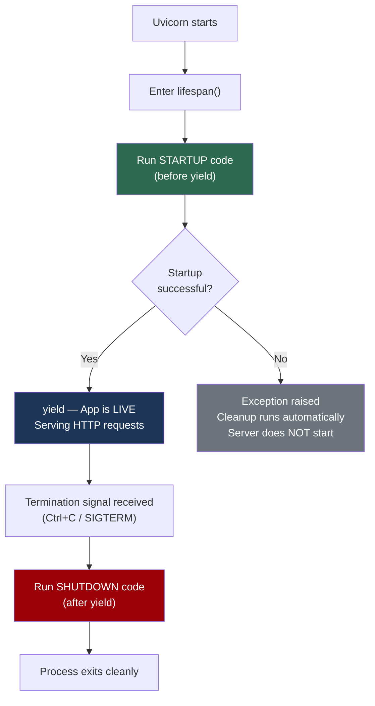

# Application Lifecycle & the Lifespan Pattern

When a web server starts up, it often needs to **initialise shared resources** (like database connection pools, caches, or background task queues) before it can serve any requests. When the server shuts down, it needs to **release those resources gracefully** to avoid data corruption, connection leaks, or orphaned processes.

This document explains how modern ASGI frameworks like **FastAPI** handle this lifecycle using Python's `@asynccontextmanager` decorator and the **lifespan** pattern.

---

## 1. The Problem: Why Do We Need Lifecycle Management?

Consider a hotel reception desk (SkyNest):

- **Opening the hotel (Startup)**: Before the first guest walks in, you need to unlock the doors, boot up the reservation system, and connect to the payment terminal.
- **Serving guests (Running)**: Guests check in, check out, order room service — the hotel is operational.
- **Closing the hotel (Shutdown)**: At the end of the day, you save all records, disconnect the payment terminal, lock the doors, and turn off the lights.

If you skip the startup phase, the payment terminal won't work. If you skip the shutdown phase, financial records may be lost.

In SkyNest's backend, the equivalent is:

| Phase | Hotel Analogy | SkyNest Backend |
| :--- | :--- | :--- |
| Startup | Boot up payment terminal | Create the PostgreSQL connection pool (`init_db()`) |
| Running | Serve guests all day | Handle HTTP requests (bookings, billing, etc.) |
| Shutdown | Save records, lock up | Close all DB connections gracefully (`close_db()`) |

---

## 2. The Old Way: `on_event` (Deprecated)

In older versions of FastAPI, you would register startup and shutdown handlers separately:

```python
# ❌ OLD WAY — deprecated since FastAPI 0.93+
@app.on_event("startup")
async def startup():
    await init_db()

@app.on_event("shutdown")
async def shutdown():
    await close_db()
```

**Problems with this approach:**
- Startup and shutdown logic are **disconnected** — defined in separate functions with no guaranteed pairing.
- If startup fails halfway, there's no clean way to ensure partial resources are cleaned up.
- You cannot share state (e.g., a variable created during startup) with the shutdown handler without using global variables.

---

## 3. The Modern Way: Lifespan Context Manager

FastAPI now uses a single **lifespan** function that wraps both phases together:

```python
from contextlib import asynccontextmanager
from fastapi import FastAPI

@asynccontextmanager
async def lifespan(app: FastAPI):
    # --- STARTUP PHASE ---
    await init_db()
    print("✅ Database connection pool initialised")

    # --- APPLICATION RUNNING PHASE ---
    yield

    # --- SHUTDOWN PHASE ---
    await close_db()
    print("🛑 Database connection pool closed")

app = FastAPI(lifespan=lifespan)
```

**Why this is better:**
- Startup and shutdown are **bound together** in one function — you can see both at a glance.
- If startup fails, Python's context manager protocol ensures cleanup runs automatically.
- You can share local variables between startup and shutdown (no globals needed).

---

## 4. What is `@asynccontextmanager`?

### The Decorator Explained

`@asynccontextmanager` is a decorator from Python's standard library (`contextlib`) that converts an **async generator function** (a function with `yield`) into an **asynchronous context manager** (something usable with `async with`).

### How It Splits the Function

The `yield` keyword acts as a **pivot point** that divides the function into two halves:

```
┌──────────────────────────────────────────────┐
│          @asynccontextmanager                │
│                                              │
│   async def lifespan(app):                   │
│       ┌─────────────────────┐                │
│       │  BEFORE yield       │ ← Startup      │
│       │  (init resources)   │   code runs    │
│       └─────────────────────┘   ONCE         │
│                                              │
│       yield  ←── Pause here, hand control    │
│                  to FastAPI to serve requests │
│                                              │
│       ┌─────────────────────┐                │
│       │  AFTER yield        │ ← Shutdown     │
│       │  (cleanup resources)│   code runs    │
│       └─────────────────────┘   ONCE         │
└──────────────────────────────────────────────┘
```

### Execution Flow



---

## 5. The Three Phases in Detail

### Phase 1: Startup (Before `yield`)

Everything **before** the `yield` statement runs exactly once when Uvicorn starts the application. This is where you initialise expensive, shared resources:

```python
# Runs ONCE at server boot
await init_db()  # Creates asyncpg connection pool to PostgreSQL
```

In SkyNest, `init_db()` creates a **connection pool** — a set of pre-opened database connections that all incoming API requests can share, rather than each request opening and closing its own connection (which would be extremely slow).

### Phase 2: Running (At `yield`)

The `yield` statement **pauses** the lifespan function and transfers control to FastAPI. The application is now live and serving HTTP requests. This phase lasts indefinitely — seconds, hours, days, or months — until the server receives a termination signal.

### Phase 3: Shutdown (After `yield`)

When the server is told to stop (via `Ctrl+C`, a Docker `SIGTERM`, or a Kubernetes pod eviction), execution resumes right after `yield`. This is where you gracefully release resources:

```python
# Runs ONCE at server termination
await close_db()  # Closes all connections in the pool
```

This prevents **connection leaks** — orphaned database connections that consume server memory and eventually exhaust PostgreSQL's connection limit.

---

## 6. Lifespan Decision Flowchart



---

## 7. What Happens If Startup Fails?

One of the key advantages of the context manager pattern is **automatic cleanup on failure**. If `init_db()` throws an exception:

1. The `yield` is never reached → the app **never starts serving requests**.
2. Python's context manager protocol ensures any `finally` blocks or exception handlers run.
3. Uvicorn logs the error and exits with a non-zero status code.

This is far safer than the old `on_event` approach, where a startup failure could leave the app in a partially initialised, broken state.

---

## 8. Key Takeaways

> [!TIP]
> **Why `yield` and not `return`?**
> `return` would end the function immediately. `yield` **pauses** execution, keeping the function alive so that the shutdown code after `yield` can run later when the server stops.

> [!IMPORTANT]
> **One `yield` only.** A lifespan function must contain exactly one `yield`. Zero yields means no running phase. Multiple yields would create multiple "pause points," which is not supported by the lifespan protocol.

> [!NOTE]
> **This pattern is not FastAPI-specific.** The `@asynccontextmanager` + `yield` pattern is a general Python concept used across many frameworks and libraries for resource management (database sessions, file handles, network connections, locks, etc.).
