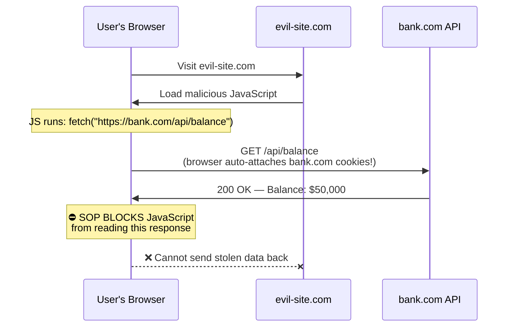
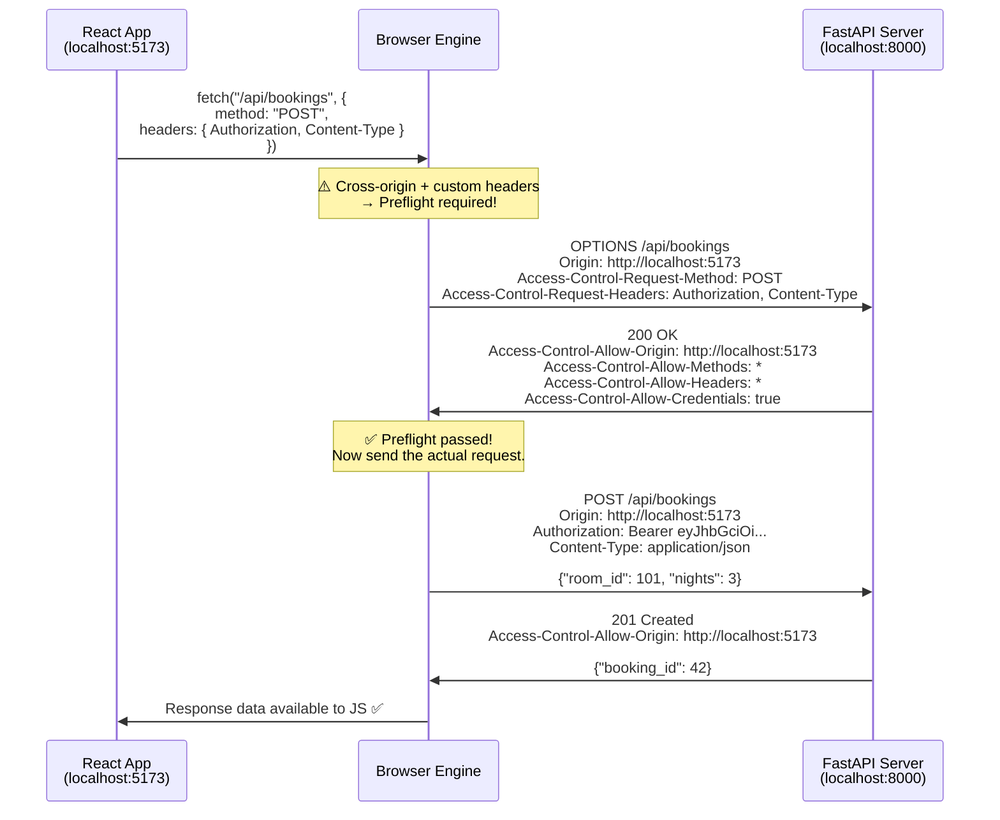
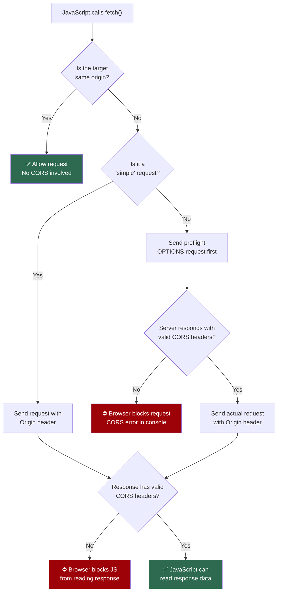

# CORS & the Same-Origin Policy

When your React frontend at `http://localhost:5173` tries to call your FastAPI backend at `http://localhost:8000`, the browser blocks the request by default. This document explains **why** this happens (Same-Origin Policy), **how** CORS fixes it, and **what** each configuration option in SkyNest's middleware does.

---

## 1. What is an "Origin"?

An **origin** is defined by three components of a URL:

```
  https://api.skynest.com:443/api/rooms?branch=colombo
  ─────   ────────────────  ───
    │            │            │
 Protocol     Domain        Port
```

Two URLs share the **same origin** only if **all three** match exactly:

| URL A | URL B | Same Origin? | Why? |
| :--- | :--- | :--- | :--- |
| `http://localhost:5173` | `http://localhost:5173/bookings` | ✅ Yes | Same protocol, domain, port |
| `http://localhost:5173` | `http://localhost:8000` | ❌ No | Different **port** (5173 vs 8000) |
| `http://skynest.com` | `https://skynest.com` | ❌ No | Different **protocol** (http vs https) |
| `https://skynest.com` | `https://api.skynest.com` | ❌ No | Different **domain** (subdomain counts) |

---

## 2. The Same-Origin Policy (SOP)

### What Is It?

The **Same-Origin Policy** is a fundamental browser security rule that states:

> *JavaScript running on Origin A cannot read responses from Origin B.*

### Why Does It Exist?

Without the SOP, any website you visit could silently call your bank's API, read your account balance, and steal your data — because your browser would automatically attach your bank's session cookies to the request.



> [!IMPORTANT]
> The SOP does **not** block the request from being *sent* — it blocks the JavaScript from *reading the response*. The bank's server still receives and processes the request. This is why server-side protections (like CSRF tokens) are also important.

---

## 3. What is CORS?

**CORS** (Cross-Origin Resource Sharing) is a mechanism that allows servers to **opt-in** to relaxing the Same-Origin Policy for specific, trusted origins.

The server does this by including special HTTP response headers that tell the browser: *"I trust this origin — let their JavaScript read my responses."*

### The Core Header

```http
Access-Control-Allow-Origin: http://localhost:5173
```

When the browser sees this header in the response, it allows the React frontend at `http://localhost:5173` to read the data.

---

## 4. Simple Requests vs. Preflight Requests

The browser handles cross-origin requests differently depending on their complexity.

### Simple Requests (No Preflight)

A request is "simple" if it meets **all** of these criteria:
- Method is `GET`, `HEAD`, or `POST`
- Only uses "safe" headers: `Accept`, `Accept-Language`, `Content-Language`, `Content-Type` (with values `text/plain`, `multipart/form-data`, or `application/x-www-form-urlencoded`)
- No custom headers like `Authorization`

For simple requests, the browser sends the request directly with an `Origin` header, and checks the response for CORS headers.

### Preflight Requests (Complex Requests)

Any request that does **not** qualify as "simple" triggers a **preflight** — a silent, automatic `OPTIONS` request sent by the browser before the actual request. This includes:
- Using `PUT`, `PATCH`, `DELETE` methods
- Sending `Content-Type: application/json`
- Sending an `Authorization` header

SkyNest's API calls almost always trigger preflights because they send JSON with Bearer tokens.



---

## 5. Browser CORS Decision Flowchart



---

## 6. SkyNest's CORS Configuration Explained

Here is the CORS middleware configured in `backend/app/main.py`:

```python
app.add_middleware(
    CORSMiddleware,
    allow_origins=[settings.FRONTEND_ORIGIN],  # e.g. "http://localhost:5173"
    allow_credentials=True,
    allow_methods=["*"],
    allow_headers=["*"],
)
```

### Option-by-Option Breakdown

#### `allow_origins=[settings.FRONTEND_ORIGIN]`
- **What it does**: Sets the `Access-Control-Allow-Origin` response header.
- **Effect**: Only the configured frontend URL (e.g., `http://localhost:5173`) is allowed to make cross-origin requests. Requests from any other origin (e.g., `https://evil-site.com`) will be blocked by the browser.

#### `allow_credentials=True`
- **What it does**: Sets `Access-Control-Allow-Credentials: true` in the response.
- **Effect**: Allows the browser to send and receive credentials (cookies, `Authorization` headers, TLS client certificates) across origins.
- **Without this**: The browser would strip the `Authorization: Bearer <token>` header from cross-origin requests, causing every protected endpoint to return 401 Unauthorized.

> [!WARNING]
> When `allow_credentials=True` is set, browsers **strictly forbid** using `allow_origins=["*"]` (wildcard). You must specify exact origins. This prevents a malicious site from making authenticated requests to your API on behalf of a logged-in user.

#### `allow_methods=["*"]`
- **What it does**: Sets `Access-Control-Allow-Methods` in the preflight response.
- **Effect**: Permits all HTTP methods (`GET`, `POST`, `PUT`, `PATCH`, `DELETE`, `OPTIONS`). SkyNest uses `POST` for creating bookings, `PUT` for updates, `DELETE` for cancellations, etc.

#### `allow_headers=["*"]`
- **What it does**: Sets `Access-Control-Allow-Headers` in the preflight response.
- **Effect**: Allows the frontend to send any request header, including `Authorization` (for JWT tokens) and `Content-Type: application/json` (for JSON payloads). Without this, the preflight check would reject these headers.

---

## 7. What a CORS Error Looks Like

If CORS is misconfigured, you'll see this in the browser's DevTools console (not in the backend logs — the server processes the request fine):

```
Access to fetch at 'http://localhost:8000/api/bookings' from origin
'http://localhost:5173' has been blocked by CORS policy: No
'Access-Control-Allow-Origin' header is present on the requested resource.
```

The backend returns a perfectly valid JSON response, but the browser **refuses to let JavaScript read it**.

> [!TIP]
> **CORS is a browser-only mechanism.** Tools like Postman, `curl`, or Python's `requests` library do not enforce CORS at all. They send requests and read responses freely. CORS only applies when JavaScript in a web browser makes the call.

---

## 8. Key Takeaways

| Concept | Summary |
| :--- | :--- |
| **Same-Origin Policy** | Browser rule: JS on Origin A cannot read responses from Origin B |
| **CORS** | Server opt-in mechanism to relax SOP for trusted origins |
| **Preflight (OPTIONS)** | Automatic browser check before complex requests (JSON, auth headers) |
| **`allow_origins`** | Which frontend URLs are trusted |
| **`allow_credentials`** | Whether auth tokens/cookies can cross origins |
| **`allow_methods`** | Which HTTP verbs the frontend can use |
| **`allow_headers`** | Which request headers the frontend can send |
