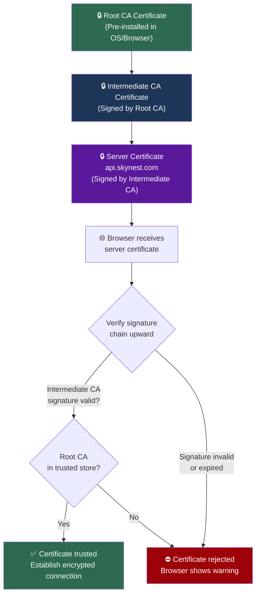
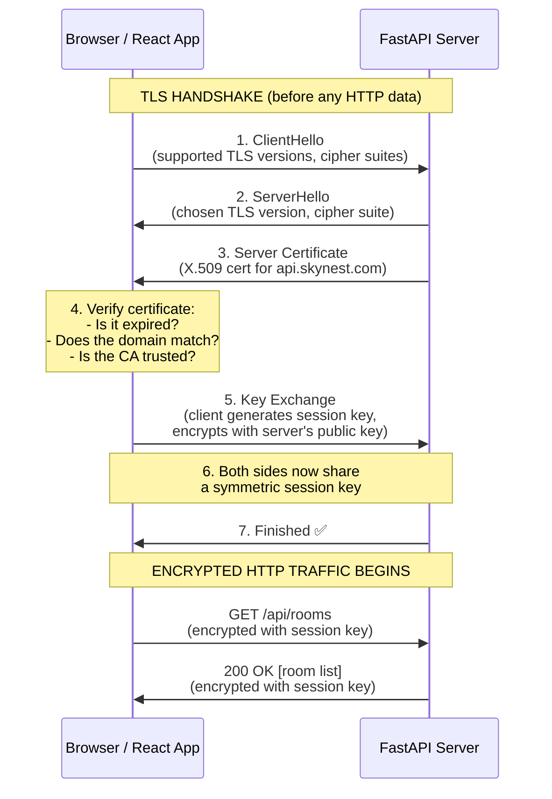
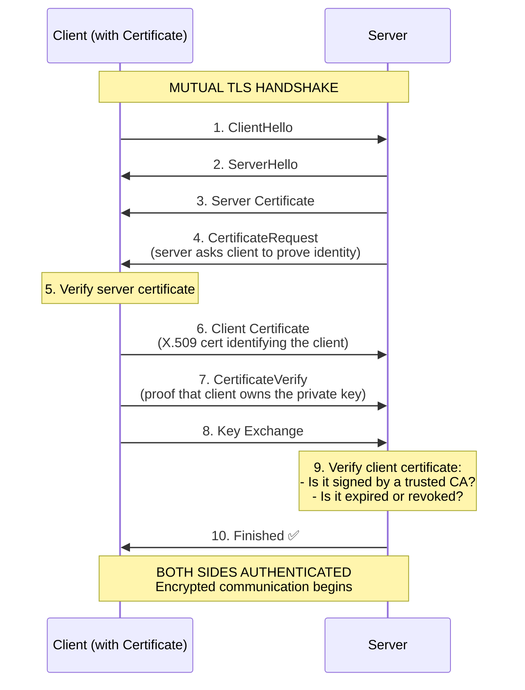

# TLS Certificates, PKI & Mutual TLS

When you visit `https://skynest.com`, your browser establishes an encrypted connection before any data is exchanged. This encryption relies on **TLS certificates** — cryptographic digital identity documents that prove the server is who it claims to be.

This document explains what TLS certificates are, what they contain, how trust is established via Certificate Authorities, and the difference between standard TLS and mutual TLS (mTLS).

---

## 1. Why HTTPS Exists

HTTP transmits data in **plain text**. Anyone positioned between the client and server (a public WiFi router, an ISP, a compromised network switch) can:

- **Eavesdrop**: Read passwords, credit card numbers, booking details.
- **Tamper**: Modify the response (e.g., inject malicious JavaScript).
- **Impersonate**: Pretend to be the server and collect credentials.

**HTTPS = HTTP + TLS** (Transport Layer Security). TLS provides:

1. **Encryption**: Data is unreadable to anyone except the client and server.
2. **Integrity**: Any tampering with data in transit is detected.
3. **Authentication**: The server proves its identity via a TLS certificate.

---

## 2. What Is a TLS Certificate?

A TLS certificate is **not** a simple ID string like a UUID. It is a **cryptographic digital passport** following the **X.509 standard**. It contains structured identity information, a public key for encryption, and a cryptographic signature from a trusted authority.

### Analogy

| Concept              | Real-World Passport                                  | TLS Certificate                         |
| :------------------- | :--------------------------------------------------- | :-------------------------------------- |
| **Subject**          | Your name and photo                                  | Domain name and organization            |
| **Issuer**           | Government that issued it                            | Certificate Authority (CA)              |
| **Validity**         | Issue date and expiry date                           | `Not Before` and `Not After` timestamps |
| **Security Feature** | Hologram, watermark, chip                            | Digital signature (cryptographic)       |
| **Verification**     | Border officer checks against known passport formats | Browser checks against trusted CA list  |

### What's Inside a Certificate

When you decode a certificate file (`.crt` / `.pem`), it contains:

```
┌────────────────────────────────────────────────────────┐
│                X.509 TLS Certificate                   │
├────────────────────────────────────────────────────────┤
│ 1. Subject (Who is this?)                              │
│    Common Name (CN): api.skynest.com                   │
│    Organization (O): SkyNest Hotels Inc.               │
│    Country (C): LK                                     │
├────────────────────────────────────────────────────────┤
│ 2. Public Key (The Lock)                               │
│    Algorithm: RSA 2048-bit (or ECDSA P-256)            │
│    Key: 04:a1:8f:92:bc:...                             │
├────────────────────────────────────────────────────────┤
│ 3. Issuer (Who vouches for this?)                      │
│    Certificate Authority: Let's Encrypt / DigiCert     │
├────────────────────────────────────────────────────────┤
│ 4. Validity Period                                     │
│    Not Before: Oct 1, 2026 00:00:00 UTC                │
│    Not After:  Dec 31, 2026 23:59:59 UTC               │
├────────────────────────────────────────────────────────┤
│ 5. Digital Signature                                   │
│    Algorithm: SHA-256 with RSA                         │
│    Signature: 3a:4b:c1:d2:...                          │
│    (Created by the CA's private key. Proves the        │
│    certificate data has NOT been tampered with.)       │
├────────────────────────────────────────────────────────┤
│ 6. Extensions                                          │
│    Subject Alternative Names (SAN):                    │
│      api.skynest.com, www.skynest.com, skynest.com     │
│    Key Usage: Digital Signature, Key Encipherment      │
└────────────────────────────────────────────────────────┘
```

### On Disk

Certificate files look like Base64-encoded blocks:

```text
-----BEGIN CERTIFICATE-----
MIIFdTCCBF2gAwIBAgISBJ3u6e7f+tqjG0Z...
... (thousands of characters) ...
k8vP2dFq1aW45lO7BwK+YQ3e9aB4
-----END CERTIFICATE-----
```

---

## 3. Why a UUID Cannot Replace a Certificate

| Feature           | UUID                                    | TLS Certificate                                |
| :---------------- | :-------------------------------------- | :--------------------------------------------- |
| **Size**          | 36 characters (128 bits)                | 1,000–4,000 bytes                              |
| **Tamper Proof?** | ❌ Anyone can forge a UUID              | ✅ Mathematically signed by a CA               |
| **Encryption?**   | ❌ Cannot encrypt anything              | ✅ Contains a Public Key for encryption        |
| **Trust?**        | ❌ Server must blindly trust the string | ✅ Verified against root CAs built into the OS |
| **Revocable?**    | ❌ No revocation mechanism              | ✅ CAs can revoke compromised certificates     |

---

## 4. Certificate Authorities & the Trust Chain

### What is a CA?

A **Certificate Authority (CA)** is a trusted organization (like Let's Encrypt, DigiCert, or Comodo) that:

1. Verifies that you actually own a domain (e.g., `api.skynest.com`).
2. Issues a signed certificate for that domain.
3. Can **revoke** certificates if they are compromised.

### The Trust Chain

Browsers and operating systems ship with a pre-installed list of **Root CAs** — about 100–150 trusted root certificates. These are the "ultimate authorities."



> [!NOTE]
> **Why intermediate CAs?** Root CA private keys are extremely valuable and stored in air-gapped, physical hardware vaults. They sign intermediate CA certificates, which do the day-to-day work of issuing server certificates. If an intermediate CA is compromised, only its certificates need to be revoked — the root CA remains safe.

---

## 5. One-Way TLS (Standard HTTPS)

This is what happens every time you visit any `https://` website. The server proves its identity to the client, but the client does **not** present a certificate.



### Key Points:

- **Only the server** proves its identity (via its certificate).
- The **client** is anonymous at the TLS level — it authenticates later via login (username/password → JWT token).
- The session key is **symmetric** (e.g., AES-256) — much faster than asymmetric encryption for bulk data transfer.

---

## 6. Mutual TLS (mTLS / Client Certificates)

In **Mutual TLS**, both the server **and** the client present certificates. The client must possess a valid certificate signed by a CA that the server trusts.



### Where Is mTLS Used?

| Use Case                         | Why mTLS?                                                                       |
| :------------------------------- | :------------------------------------------------------------------------------ |
| **Microservice-to-microservice** | Payment service calling bank core API — no human user to type a password        |
| **Enterprise VPN / intranets**   | Employees must have a certificate installed to access internal portals          |
| **IoT devices**                  | Smart meters, sensors authenticate to cloud backends with embedded certificates |
| **Government / banking systems** | Regulatory requirement for strong, certificate-based authentication             |

> [!TIP]
> **SkyNest does NOT use mTLS** for its frontend-to-backend communication. Instead, it uses one-way TLS (HTTPS) for encryption + JWT Bearer tokens for user authentication. mTLS would be overkill for a web application where end users log in via a browser form.

---

## 7. Where Are Certificates Stored?

| Location                               | What's Stored                                                           |
| :------------------------------------- | :---------------------------------------------------------------------- |
| **Operating System Certificate Store** | Root CA certificates (pre-installed by Microsoft/Apple/Google)          |
| **Browser's built-in store**           | Firefox maintains its own CA store; Chrome/Edge use the OS store        |
| **Web server config**                  | The server's own certificate + private key (e.g., in `/etc/ssl/certs/`) |
| **Hardware Security Module (HSM)**     | Root CA private keys — air-gapped, tamper-resistant physical devices    |

---

## 8. Key Takeaways

> [!IMPORTANT]
> **TLS certificates are NOT passwords or tokens.** They are cryptographic documents with embedded public keys, CA signatures, and validity periods. They cannot be forged without the CA's private key.

> [!NOTE]
> **You can inspect any website's certificate** by clicking the padlock icon in your browser's address bar → "Connection is secure" → "Certificate is valid." This shows the subject, issuer, validity dates, and the full trust chain.
