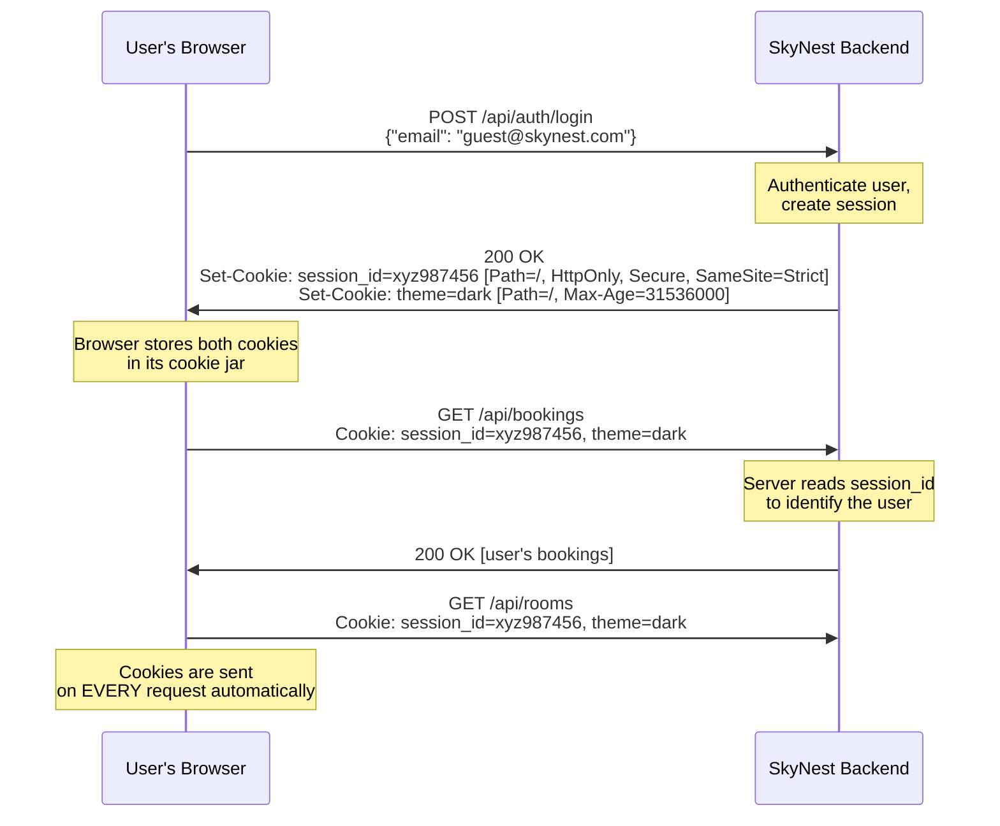
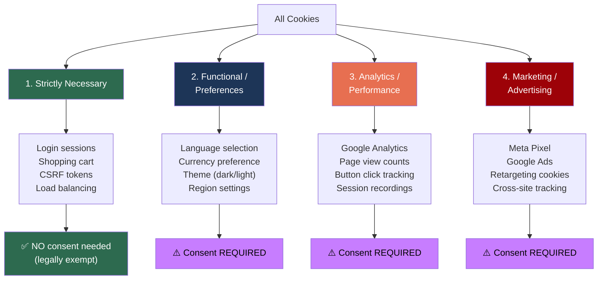
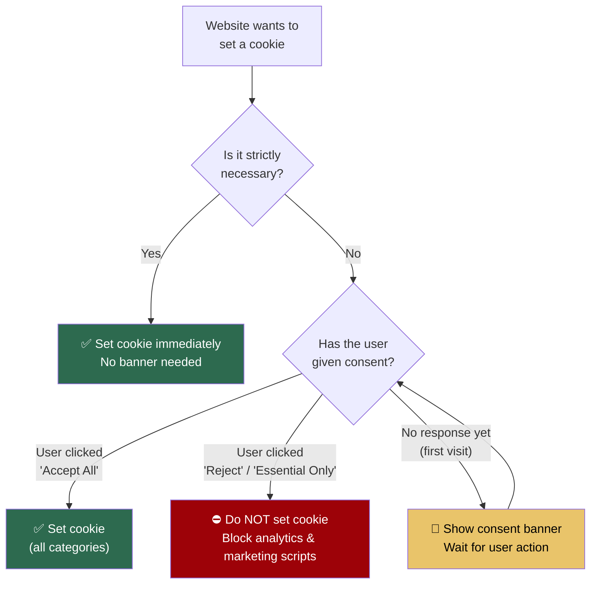

# Cookies, Privacy Laws & Consent Banners

Cookies are one of the oldest mechanisms for websites to remember information about visitors. This document explains how cookies work at the HTTP level, their security flags, the privacy regulations that mandate consent banners, and what happens when users accept or reject them.

---

## 1. What Is a Cookie?

A cookie is a small piece of text data (key-value pair, up to ~4 KB) that a **server instructs the browser to store**. Unlike `localStorage`, which is managed entirely by JavaScript, cookies are fundamentally an **HTTP protocol feature** — they are set via response headers and sent via request headers.

### The Cookie Lifecycle



### Key Characteristics
- **Set by the server** via the `Set-Cookie` HTTP response header.
- **Sent automatically** by the browser on every subsequent request to the same domain via the `Cookie` request header.
- **Domain-scoped**: A cookie set by `skynest.com` is never sent to `google.com`.
- **Size-limited**: ~4 KB per cookie, ~50 cookies per domain.

---

## 2. Cookie Attributes & Security Flags

When a server sets a cookie, it can attach several attributes that control its behavior and security:

```http
Set-Cookie: session_id=xyz987; Path=/; Max-Age=86400; HttpOnly; Secure; SameSite=Strict
```

### Attribute Breakdown

| Attribute | Example | Purpose |
| :--- | :--- | :--- |
| **`Path`** | `Path=/` | Cookie is sent for all paths on the domain |
| **`Domain`** | `Domain=.skynest.com` | Cookie is shared across subdomains |
| **`Max-Age`** | `Max-Age=86400` | Cookie expires 86400 seconds (1 day) from now |
| **`Expires`** | `Expires=Wed, 21 Oct 2026 07:28:00 GMT` | Cookie expires at this specific date/time |
| **`HttpOnly`** | `HttpOnly` | ⛔ JavaScript (`document.cookie`) **cannot** read this cookie |
| **`Secure`** | `Secure` | Cookie is only transmitted over HTTPS, never plain HTTP |
| **`SameSite`** | `SameSite=Strict` | Controls cross-site cookie sending behavior |

### `SameSite` Values Explained

| Value | Behavior |
| :--- | :--- |
| `Strict` | Cookie is **never** sent on cross-site requests (strongest protection against CSRF) |
| `Lax` | Cookie is sent on cross-site **navigational** requests (clicking a link) but **not** on API calls or form submissions |
| `None` | Cookie is sent on all cross-site requests (requires `Secure` flag). Used for third-party cookies |

---

## 3. Session Cookies vs. Persistent Cookies

| Feature | Session Cookie | Persistent Cookie |
| :--- | :--- | :--- |
| **Defined by** | No `Max-Age` or `Expires` attribute | Has `Max-Age` or `Expires` attribute |
| **Stored in** | **RAM** (browser process memory) | **Disk** (SQLite database file) |
| **Lifetime** | Deleted when browser is fully closed | Survives browser restarts until expiration |
| **Use case** | Online banking sessions | "Remember Me" logins, language preferences |

---

## 4. Privacy Regulations & Why Consent Banners Exist

### The Legal Landscape

Websites do not display cookie consent banners because they *want* to — they do so because **privacy laws legally require it**.

| Regulation | Region | Key Requirement |
| :--- | :--- | :--- |
| **GDPR** (General Data Protection Regulation) | European Union | Explicit, informed consent **before** placing non-essential cookies |
| **ePrivacy Directive** ("Cookie Law") | European Union | Specific rules on storing/accessing information on user devices |
| **CCPA / CPRA** | California, USA | Right to opt-out of data sale; transparency requirements |
| **POPIA** | South Africa | Consent required for processing personal information |
| **PDPA** | Thailand, Singapore | Similar consent and notice requirements |

### The Core Principle

> Storing or accessing **any non-essential information** on a user's device requires **explicit, informed consent before** it happens.

Violations can result in massive fines — up to **€20 million or 4% of global annual revenue** under GDPR.

---

## 5. The Four Cookie Categories Under Privacy Law



### Category Details

#### 1. Strictly Necessary (No Consent Needed)
Cookies that the website **cannot function without**:
- Session cookies for login state
- Shopping cart contents
- CSRF protection tokens
- Server load balancing

#### 2. Functional / Preferences (Consent Required)
Cookies that **enhance** the user experience but are not essential:
- Remembering selected language or currency
- UI theme preference (dark/light mode)
- Auto-filled form data

#### 3. Analytics / Performance (Consent Required)
Cookies that **track how visitors use** the website:
- Google Analytics (`_ga`, `_gid` cookies)
- Page view counts and session duration
- Hotjar / FullStory session recordings
- A/B testing experiment assignments

#### 4. Marketing / Advertising (Consent Required)
Cookies that **track users across the internet** for targeted advertising:
- Meta Pixel (`_fbp` cookie) — tracks you across sites with Facebook ads
- Google Ads (`_gcl_au` cookie) — conversion tracking
- Retargeting cookies — show you ads for products you viewed on other sites

---

## 6. Cookie Consent Decision Flowchart



---

## 7. What Happens When Users Accept vs. Reject?

### If User Clicks "Accept All"
- All 4 categories of cookies are placed on the device.
- Google Analytics begins tracking page views.
- Marketing pixels (Meta, Google Ads) start profiling browsing behavior across the internet.
- The consent choice itself is stored in a cookie (e.g., `cookie_consent=all`).

### If User Clicks "Reject" or "Essential Only"
1. **Website still works normally**: Login, bookings, payments — all functional. Strictly Necessary cookies still operate.
2. **No cross-site tracking**: Ad networks cannot store tracking IDs.
3. **Ads become generic**: You may still see ads, but they are contextual (based on the page content) rather than personalized (based on your browsing history).
4. **Analytics are disabled**: Your visit is not logged in Google Analytics, Hotjar, etc.
5. **Consent rejection is stored**: Usually in a cookie like `cookie_consent=essential_only` so the banner doesn't appear again.

---

## 8. Websites That Don't Show Cookie Banners

If you visit a site without a cookie banner, it's typically because:

| Scenario | Explanation |
| :--- | :--- |
| **Only Strictly Necessary cookies** | If a site uses cookies solely for sessions/login and nothing else, no consent is legally required |
| **Cookie-free analytics** | Privacy-first tools (Plausible, Fathom, Umami) collect anonymous page counts without placing any cookies or identifiers on the device |
| **Outside regulated jurisdictions** | Websites that don't target EU/California users and operate in countries without cookie laws |
| **Non-compliance** | Some sites simply ignore the regulations (risky but common for small sites) |

---

## 9. Cookies vs. SkyNest's Approach

> [!NOTE]
> **SkyNest uses JWT Bearer tokens stored in `localStorage`** instead of cookies for authentication. This means:
> - No session cookies are placed on the user's device for auth.
> - The `Authorization: Bearer <token>` header is attached manually by JavaScript, not automatically by the browser.
> - If SkyNest adds Google Analytics or marketing pixels in the future, a cookie consent banner would be needed for **those** cookies, not for the JWT-based auth.

---

## 10. Key Takeaways

> [!IMPORTANT]
> **Cookies are an HTTP protocol feature, not a JavaScript feature.** They are set via `Set-Cookie` response headers and sent via `Cookie` request headers — automatically, on every request, without JavaScript involvement.

> [!TIP]
> **The `HttpOnly` flag is the most important security flag.** It prevents JavaScript from reading the cookie via `document.cookie`, which means even if your site has an XSS vulnerability, attackers cannot steal session cookies marked as `HttpOnly`.

> [!WARNING]
> **Never store sensitive data directly in cookies.** Store only a session ID or token reference. The actual user data should live server-side (in the database) and be looked up using that session ID.
