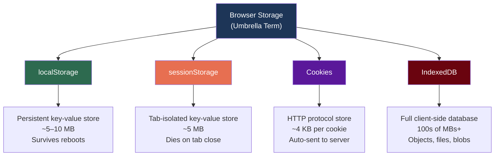
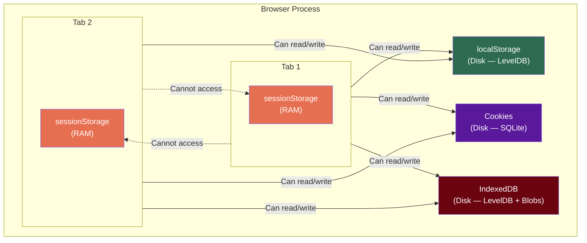
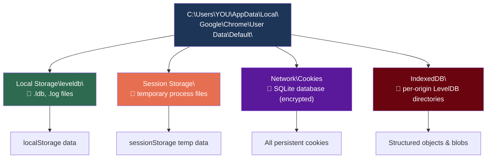

# Browser Storage Mechanisms (Deep Dive)

Modern web browsers provide several client-side storage mechanisms beyond cookies. This document explores all four — `localStorage`, `sessionStorage`, Cookies, and `IndexedDB` — covering their APIs, physical storage locations, capacity, and how to inspect them using browser DevTools.

---

## 1. "Browser Storage" — The Umbrella Term

**"Browser Storage"** is not a single technology. It is a collective term for all client-side data storage mechanisms provided by the browser. Each mechanism serves a different purpose and has different characteristics.



---

## 2. `localStorage`

### What It Is
A persistent, synchronous key-value store that saves data as strings on the user's computer. Data remains indefinitely until cleared programmatically or by the user.

### API

```javascript
// Save data
localStorage.setItem("theme", "dark");
localStorage.setItem("token", "eyJhbGciOiJIUzI1NiJ9...");

// Read data
const theme = localStorage.getItem("theme");  // "dark"

// Delete one key
localStorage.removeItem("token");

// Clear everything for this origin
localStorage.clear();

// Check how many items are stored
console.log(localStorage.length);  // e.g. 2
```

### Characteristics

| Property | Value |
| :--- | :--- |
| **Capacity** | ~5 MB to 10 MB (varies by browser) |
| **Data format** | Key-value strings only (use `JSON.stringify` / `JSON.parse` for objects) |
| **Persistence** | Permanent until explicitly cleared |
| **Scope** | Shared across all tabs/windows on the same origin |
| **Sent to server?** | ❌ Never (client-side only) |
| **JavaScript access** | ✅ Always accessible (vulnerable to XSS) |

### Physical Storage (On Disk)
Browsers use **LevelDB** (Google's embedded key-value database) to store `localStorage` data:

```
Chrome (Windows):
C:\Users\<you>\AppData\Local\Google\Chrome\User Data\Default\Local Storage\leveldb\

Edge (Windows):
C:\Users\<you>\AppData\Local\Microsoft\Edge\User Data\Default\Local Storage\leveldb\
```

The `.ldb` and `.log` files inside this directory contain the actual key-value data in a binary format.

### SkyNest Usage
```javascript
// After login, store the JWT token
localStorage.setItem("token", response.data.access_token);

// On every API call, read it and attach to Authorization header
const token = localStorage.getItem("token");
fetch("/api/bookings", {
    headers: { "Authorization": `Bearer ${token}` }
});

// On logout, remove the token
localStorage.removeItem("token");
```

---

## 3. `sessionStorage`

### What It Is
A temporary, tab-isolated key-value store. It has the exact same API as `localStorage`, but with a critical difference: data is **scoped to a single browser tab** and is **deleted when that tab closes**.

### API

```javascript
// Identical API to localStorage
sessionStorage.setItem("booking_draft", JSON.stringify({
    room_id: 101,
    check_in: "2026-10-10",
    check_out: "2026-10-15"
}));

const draft = JSON.parse(sessionStorage.getItem("booking_draft"));

sessionStorage.removeItem("booking_draft");
sessionStorage.clear();
```

### Characteristics

| Property | Value |
| :--- | :--- |
| **Capacity** | ~5 MB |
| **Data format** | Key-value strings only |
| **Persistence** | Deleted when the **tab** is closed (survives page refreshes) |
| **Scope** | Isolated to that one specific tab |
| **Sent to server?** | ❌ Never |
| **JavaScript access** | ✅ Always accessible |

### Tab Isolation Explained

```
Browser Window
├── Tab 1 (Booking: Tokyo)
│   └── sessionStorage: { "booking_draft": {"dest": "Tokyo"} }
│
├── Tab 2 (Booking: Paris)
│   └── sessionStorage: { "booking_draft": {"dest": "Paris"} }
│
└── Tab 3 (Dashboard)
    └── sessionStorage: { "last_filter": "revenue" }

Each tab has its OWN sessionStorage. They do NOT share or overwrite each other.
```

### Physical Storage (In RAM)
`sessionStorage` lives in the **RAM** allocated to that specific browser tab's render process. There are no persistent disk files. When the tab's process is killed, the data vanishes.

### SkyNest Usage
```javascript
// Multi-step booking wizard — save progress between steps
sessionStorage.setItem("wizard_step", "2");
sessionStorage.setItem("booking_draft", JSON.stringify({
    room_id: 101,
    guests_count: 2
}));
// If user refreshes, data survives. If user closes tab, data is gone.
```

---

## 4. Cookies (Client-Side Perspective)

### What They Are
Cookies are the oldest browser storage mechanism (1994). Unlike `localStorage` and `sessionStorage`, cookies are automatically **sent to the server on every HTTP request** to the same domain.

### JavaScript API

```javascript
// Set a cookie (client-side)
document.cookie = "theme=dark; Path=/; Max-Age=31536000";

// Read all cookies (returns a single semicolon-separated string)
console.log(document.cookie);  // "theme=dark; lang=en"

// Delete a cookie (set Max-Age to 0)
document.cookie = "theme=; Path=/; Max-Age=0";
```

> [!WARNING]
> **`HttpOnly` cookies are invisible to JavaScript.** `document.cookie` only returns cookies that do NOT have the `HttpOnly` flag. Session cookies with `HttpOnly` are completely hidden from client-side code — only the server can read them.

### Characteristics

| Property | Value |
| :--- | :--- |
| **Capacity** | ~4 KB per cookie, ~50 cookies per domain |
| **Data format** | String (`key=value`) |
| **Persistence** | Session cookies: RAM (browser close). Persistent: Disk (until expiry) |
| **Scope** | Shared across all tabs/windows on the domain |
| **Sent to server?** | ✅ Automatically on every request |
| **JavaScript access** | Only if `HttpOnly` is NOT set |

### Physical Storage (On Disk)
Persistent cookies are stored in a **SQLite 3 database** file:

```
Chrome (Windows):
C:\Users\<you>\AppData\Local\Google\Chrome\User Data\Default\Network\Cookies

Edge (Windows):
C:\Users\<you>\AppData\Local\Microsoft\Edge\User Data\Default\Network\Cookies
```

> [!NOTE]
> On Windows, Chrome and Edge **encrypt cookie values** using the Windows Data Protection API (DPAPI / `CryptProtectData`). Even if malware reads the `Cookies` SQLite file, the values are encrypted and tied to your Windows user account.

---

## 5. IndexedDB

### What It Is
A full-featured, asynchronous, transactional **client-side database** built into the browser. Unlike the simple key-value stores of `localStorage`, IndexedDB can store complex objects, large files (blobs), and supports indexed queries.

### API (Simplified)

```javascript
// Open (or create) a database
const request = indexedDB.open("SkyNestOffline", 1);

request.onupgradeneeded = (event) => {
    const db = event.target.result;
    // Create an object store (like a table)
    const store = db.createObjectStore("rooms", { keyPath: "room_id" });
    store.createIndex("branch", "branch_id", { unique: false });
};

request.onsuccess = (event) => {
    const db = event.target.result;

    // Write data
    const tx = db.transaction("rooms", "readwrite");
    tx.objectStore("rooms").put({
        room_id: 101,
        branch_id: "br_colombo",
        type: "Deluxe",
        rate: 250.00
    });

    // Read data
    const readTx = db.transaction("rooms", "readonly");
    const getReq = readTx.objectStore("rooms").get(101);
    getReq.onsuccess = () => console.log(getReq.result);
};
```

### Characteristics

| Property | Value |
| :--- | :--- |
| **Capacity** | Hundreds of MBs to GBs (browser asks permission for large amounts) |
| **Data format** | Structured objects, arrays, blobs, files |
| **Persistence** | Permanent until explicitly cleared |
| **Scope** | Shared across all tabs/windows on the same origin |
| **Sent to server?** | ❌ Never |
| **JavaScript access** | ✅ Always accessible |
| **API style** | Asynchronous (event-based or Promise-wrapped) |

### Physical Storage (On Disk)
IndexedDB uses **LevelDB** for structured data and separate **blob files** for large binary data:

```
Chrome (Windows):
C:\Users\<you>\AppData\Local\Google\Chrome\User Data\Default\IndexedDB\
└── https_localhost_5173.indexeddb.leveldb/   ← per-origin directory
    ├── 000003.log
    ├── CURRENT
    ├── LOCK
    └── MANIFEST-000001
```

### Use Cases
- Offline-first Progressive Web Apps (PWAs)
- Caching large datasets (room catalogs, guest lists) for fast UI rendering
- Storing images, PDFs, or video thumbnails for offline access
- Client-side search indexes

---

## 6. Architecture: Where Everything Lives



---

## 7. Physical Disk Layout (Chrome on Windows)



---

## 8. How to Inspect Storage in DevTools

1. Open your browser and press **`F12`** (or right-click → **Inspect**).
2. Go to the **Application** tab (Chrome/Edge) or **Storage** tab (Firefox).
3. In the left sidebar under **Storage**, expand:
   - **Local Storage** → Click your origin URL → See key-value pairs.
   - **Session Storage** → Click your origin URL → See tab-specific data.
   - **IndexedDB** → Expand databases → Browse object stores like database tables.
   - **Cookies** → Click your origin URL → See all cookies with their attributes.

You can **edit, delete, or add** entries directly from this panel for debugging.

---

## 9. Key Takeaways

> [!TIP]
> **Use DevTools (F12 → Application tab)** to view, edit, and delete any browser storage during development. This is much easier than navigating to the raw file system paths.

> [!IMPORTANT]
> **`sessionStorage` is the only tab-isolated storage.** All other mechanisms (`localStorage`, Cookies, IndexedDB) are shared across all tabs and windows for the same origin.

> [!NOTE]
> **Cookies are the only storage sent to the server automatically.** `localStorage`, `sessionStorage`, and `IndexedDB` are purely client-side. JavaScript must explicitly read and include their data in API requests.
