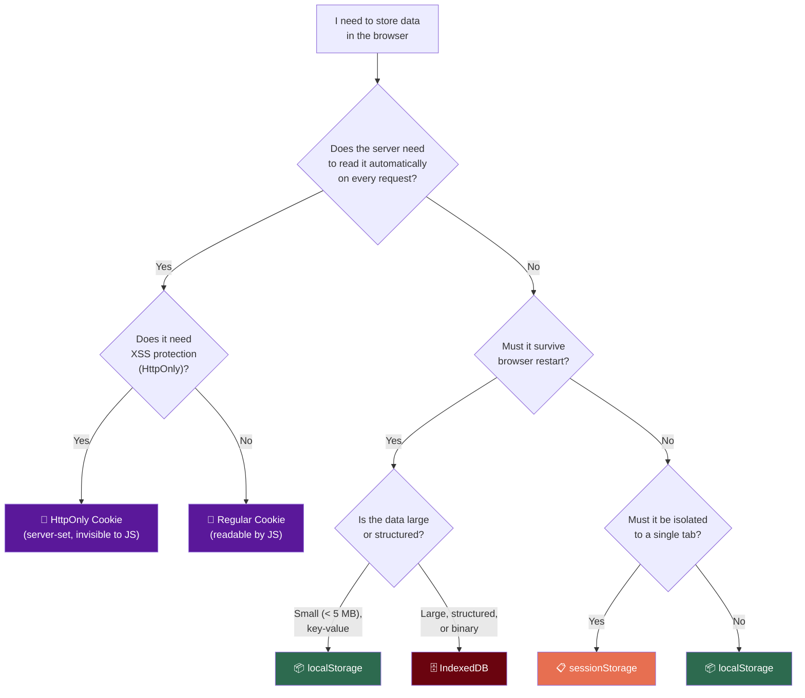

# Storage Comparison & Decision Guide

This document provides head-to-head comparisons between the most commonly confused storage pairs, a master comparison table of all four browser storage mechanisms, and a decision flowchart to help you choose the right one for any use case.

---

## 1. Persistent Cookies vs. `localStorage`

Both store data **permanently on disk** that survives closing tabs, restarting browsers, and computer reboots. However, they differ fundamentally in how data is transmitted and managed.

### Comparison

| Feature | Persistent Cookies | `localStorage` |
| :--- | :--- | :--- |
| **Capacity** | ~4 KB (very small) | ~5 MB to 10 MB |
| **Sent to server?** | ✅ **Yes**, automatically on every HTTP request | ❌ **No**, client-side only |
| **Expiration** | Built-in (`Max-Age` / `Expires`); auto-deleted | No expiration; stored forever until cleared |
| **XSS Protection** | ✅ Can be `HttpOnly` (invisible to JS) | ❌ Always readable by JavaScript |
| **Set by** | Server (`Set-Cookie` header) or JavaScript | JavaScript only |
| **Network overhead** | Adds bytes to every request | Zero network impact |

### When to Use Which?

**Use Persistent Cookies when:**
- The **server** needs to read the data automatically on every request (e.g., session ID, A/B test assignment).
- You need the `HttpOnly` flag for XSS protection.
- The data has a natural expiration (e.g., "Remember Me for 30 days").

**Use `localStorage` when:**
- Only the **frontend** needs the data (e.g., UI theme, saved form drafts, cached API responses).
- You need more than 4 KB of storage.
- You don't want the data sent to the server on every request (reduces network overhead).

### Real-World Examples

| Scenario | Best Choice | Why |
| :--- | :--- | :--- |
| "Remember Me" login (30 days) | **Persistent Cookie** | Server reads it before any JS runs; `HttpOnly` prevents theft |
| SkyNest JWT token for React SPA | **`localStorage`** | Frontend reads it, manually attaches to `Authorization` header |
| User's preferred dark/light theme | **`localStorage`** | Server doesn't need this; only React needs it to apply CSS |
| Google Analytics user ID | **Persistent Cookie** | Analytics script on every page needs to send it to Google's servers |

---

## 2. Session Cookies vs. `sessionStorage`

Both are **temporary** and exist only during active usage. However, they differ crucially in **tab isolation** and **when they are deleted**.

### Comparison

| Feature | Session Cookies | `sessionStorage` |
| :--- | :--- | :--- |
| **Tab isolation** | ❌ Shared across ALL tabs/windows | ✅ Isolated to ONE specific tab |
| **Deleted when** | Entire **browser** is closed (all windows) | Specific **tab** is closed |
| **Sent to server?** | ✅ Yes, automatically | ❌ No, client-side only |
| **Capacity** | ~4 KB | ~5 MB |
| **XSS Protection** | ✅ Can be `HttpOnly` | ❌ Always accessible to JS |
| **Survives refresh?** | ✅ Yes | ✅ Yes |

### The Tab Isolation Difference (Visual)

```
┌─────────────────────────────────────────────────────────────┐
│  Browser Instance                                           │
│                                                             │
│  ┌─── Tab 1 ────────────┐    ┌─── Tab 2 ────────────┐      │
│  │ sessionStorage:       │    │ sessionStorage:       │      │
│  │   booking: "Tokyo"    │    │   booking: "Paris"    │      │
│  │                       │    │                       │      │
│  │ Session Cookie:       │    │ Session Cookie:       │      │
│  │   (same as Tab 2) ────┼────┼── session_id=xyz987   │      │
│  └───────────────────────┘    └───────────────────────┘      │
│                                                             │
│  sessionStorage: Tab-isolated (Tokyo ≠ Paris)               │
│  Session Cookie: Shared (same session_id in both tabs)      │
└─────────────────────────────────────────────────────────────┘
```

### When to Use Which?

**Use Session Cookies when:**
- You need a single login session shared across all tabs (e.g., online banking — opening a new tab shouldn't require re-login).
- The server needs the session data automatically.

**Use `sessionStorage` when:**
- Data must be **isolated per tab** to prevent conflicts (e.g., two simultaneous booking searches for different rooms).
- You need temporary frontend state that auto-cleans when the user closes the tab.

### Real-World Examples

| Scenario | Best Choice | Why |
| :--- | :--- | :--- |
| Online banking session | **Session Cookie** | Shared across tabs (open statements in new tab without re-logging in); deleted when browser closes |
| Multi-step booking wizard | **`sessionStorage`** | Each tab has its own draft; closing the tab cleans up automatically |
| CSRF token for form submission | **Session Cookie** | Server needs to read and validate on every POST request |
| Temporary search filter state | **`sessionStorage`** | Only relevant to the current tab's search context |

---

## 3. Master Comparison Table

| Feature | `localStorage` | `sessionStorage` | Cookies | `IndexedDB` |
| :--- | :--- | :--- | :--- | :--- |
| **Capacity** | ~5–10 MB | ~5 MB | ~4 KB per cookie | 100s of MBs to GBs |
| **Persistence** | Permanent | Tab close | Configurable (session or expiry) | Permanent |
| **Tab sharing** | All tabs | Single tab only | All tabs | All tabs |
| **Sent to server?** | ❌ No | ❌ No | ✅ Yes (every request) | ❌ No |
| **XSS protected?** | ❌ No | ❌ No | ✅ If `HttpOnly` | ❌ No |
| **Data format** | Strings | Strings | Strings | Objects, blobs, files |
| **API style** | Synchronous | Synchronous | String manipulation | Asynchronous |
| **Physical storage** | Disk (LevelDB) | RAM | Disk (SQLite) or RAM | Disk (LevelDB + Blobs) |
| **Best for** | Themes, tokens, settings | Tab-specific form state | Server-read sessions | Offline apps, large data |

---

## 4. Decision Flowchart: Which Storage to Use?



---

## 5. Security Comparison

### XSS (Cross-Site Scripting) Vulnerability

If an attacker injects malicious JavaScript into your website (via an XSS vulnerability), they can:

| Storage | Can attacker read it? | Mitigation |
| :--- | :--- | :--- |
| `localStorage` | ✅ Yes — `localStorage.getItem("token")` | Sanitise all user inputs; use Content Security Policy |
| `sessionStorage` | ✅ Yes — `sessionStorage.getItem("data")` | Same as above |
| Cookie (no `HttpOnly`) | ✅ Yes — `document.cookie` | Set `HttpOnly` flag |
| Cookie (`HttpOnly`) | ❌ No — invisible to JavaScript | ✅ Best protection for session tokens |
| `IndexedDB` | ✅ Yes — full database access | Same as `localStorage` |

> [!IMPORTANT]
> **No client-side storage is safe from XSS** except `HttpOnly` cookies. The primary defense against XSS is preventing the injection in the first place (input sanitisation, Content Security Policy headers, framework-level escaping).

### CSRF (Cross-Site Request Forgery) Vulnerability

| Storage | Vulnerable to CSRF? | Why |
| :--- | :--- | :--- |
| Cookies | ✅ Yes (if `SameSite=None`) | Browser automatically sends cookies, even from malicious sites |
| `localStorage` / `sessionStorage` / `IndexedDB` | ❌ No | Data is never sent automatically; JavaScript must explicitly attach it |

> [!TIP]
> **SkyNest's JWT-in-localStorage approach is immune to CSRF** because the token is never sent automatically — React must explicitly read it and attach it to the `Authorization` header. However, it is vulnerable to XSS, which is mitigated by React's built-in JSX escaping and a strict Content Security Policy.

---

## 6. Key Takeaways

> [!NOTE]
> **There is no single "best" storage.** Each mechanism was designed for a specific purpose. The decision depends on whether the server needs the data, how long it should persist, how much space you need, and what security threats you need to protect against.

> [!TIP]
> **For most SPA (Single Page Application) projects like SkyNest:**
> - Use **`localStorage`** for auth tokens, user preferences, and cached settings.
> - Use **`sessionStorage`** for temporary per-tab state (wizard progress, search filters).
> - Avoid cookies for auth unless you need `HttpOnly` protection and are using a server-side rendering framework.
> - Use **IndexedDB** only if you need offline support or large dataset caching.
