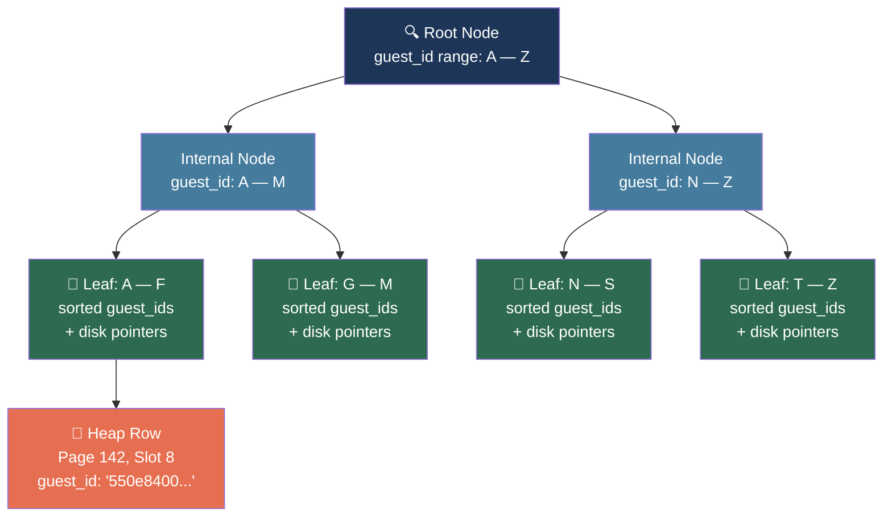
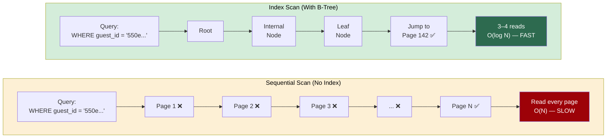

# PostgreSQL Indexing Fundamentals & SkyNest Architecture

This document provides a comprehensive guide to understanding database indexes, how they function under the hood in PostgreSQL, the trade-offs of indexing, and the architectural rationale behind every index implemented in the **SkyNest Hotel Management System** (`db/schema/03_indexes.sql`).

---

## 1. What is an Index and Why Do We Need It?

### The Real-World Analogy: A Textbook Index
Imagine you have a 1,000-page medical textbook and want to find every reference to **"Aspirin"**:
* **Without an Index (Sequential Scan / Full Table Scan)**: You must read every page from page 1 to 1,000. For a computer, this requires reading every single page off the hard disk into RAM ($O(N)$ time complexity).
* **With an Index (Index Scan)**: You flip to the back of the book where topics are sorted alphabetically. You look under **"A"**, find `"Aspirin"`, and get direct page numbers (`pages 42, 115, 308`). You jump directly to those pages ($O(\log N)$ time complexity).

### How Databases Store Data Without an Index
By default, PostgreSQL stores table rows in an unordered storage structure called a **Heap**:
* New rows are inserted into whichever disk page has available free space.
* Rows are not sorted by date, ID, or name.
* Without an index, a query like `SELECT * FROM booking WHERE guest_id = '...'` forces PostgreSQL to load and inspect **every single row across all disk blocks**.
  * On a table with 1,000 rows, this takes less than a millisecond.
  * On a table with 1,000,000 rows, this takes seconds or minutes, choking CPU and disk I/O.

---

## 2. How Indexes Work Under the Hood

When you create an index in PostgreSQL:
```sql
CREATE INDEX idx_booking_guest ON booking (guest_id);
```

PostgreSQL builds a separate, specialized helper data structure:
1. It copies the indexed column values (`guest_id`) and sorts them.
2. It pairs each sorted value with a **Tuple Identifier (TID / ctid)**, which is the physical disk address (`Block Number, Offset Index`) of the corresponding row in the heap table.

### The B-Tree (Balanced Tree) Structure
By default, PostgreSQL creates **B-Tree indexes**. A B-Tree is a self-balancing search tree where all leaf nodes remain at the same depth:




* **Binary search traversal**: Finding a key in a million rows takes only $3 \text{ to } 4$ node reads.
* Query execution time drops from **several seconds down to sub-milliseconds**.

### Sequential Scan vs. Index Scan



---

## 3. Specialized Indexing Techniques in SkyNest

### A. Composite (Multi-Column) Indexes
A composite index covers multiple columns simultaneously:
```sql
CREATE INDEX idx_booking_room_dates ON booking (room_id, check_in_date, check_out_date);
```
* **The Leftmost Prefix Rule**: The index is sorted strictly in the order the columns are declared:
  1. Primarily sorted by `room_id`.
  2. Secondarily sorted by `check_in_date`.
  3. Tertiary sorted by `check_out_date`.
* **Index-Only Scan**: If a query only needs `room_id`, `check_in_date`, and `check_out_date`, PostgreSQL satisfies the entire query directly from the index tree without fetching rows from the heap table.

### B. Partial (Filtered) Indexes
A partial index uses a `WHERE` clause to only index a subset of rows:
```sql
CREATE INDEX idx_bill_outstanding ON bill (balance_flag) WHERE balance_flag = TRUE;
```
* In an operating hotel, 99% of historical bills are paid (`balance_flag = FALSE`), and only 1% are unpaid (`balance_flag = TRUE`).
* By indexing only unpaid bills, the index tree remains microscopic, fits permanently in high-speed RAM cache, and speeds up unpaid balance audits without wasting memory on settled bills.

### C. Implicit Indexes
PostgreSQL automatically creates a unique B-Tree index for every column with a `PRIMARY KEY` or `UNIQUE` constraint. Therefore, explicit `CREATE INDEX` statements are omitted for candidate keys like `guest.nic_passport` or `user_account.email` to avoid redundant storage and write overhead.

---

## 4. The Trade-Offs: Why Not Index Everything?

Indexes are not free. Every index introduced has real operational costs:

1. **Write Overhead (DML Penalties)**:
   * Every `INSERT` must write to the table **plus** rebalance every index on that table.
   * `UPDATE` statements on indexed columns require updating both the row and the index tree.
   * `DELETE` statements require marking entries dead in both the heap and the indexes.
2. **Disk & Memory Footprint**:
   * Indexes consume disk storage and compete for space in the PostgreSQL shared buffer cache (`shared_buffers` in RAM).
3. **The Golden Rule**: Index columns that are frequently filtered (`WHERE`), joined (`JOIN`), sorted (`ORDER BY`), or checked for foreign key references. Do not index rarely searched columns or tables with high write-to-read ratios.

---

## 5. SkyNest Deep Dive: Detailed Index Rationale

### 1. `idx_booking_room_dates`
* **Table**: `booking`
* **Columns**: `(room_id, check_in_date, check_out_date)`
* **Why**: Powers the reservation overlap check in the stored procedure `create_booking()` and trigger `trg_prevent_double_booking`.
* **Column Breakdown**:
  * `room_id`: Narrows the search down to the specific physical room.
  * `check_in_date` & `check_out_date`: Evaluates the overlap window $(\text{check\_in} < \text{requested\_out} \land \text{check\_out} > \text{requested\_in})$ via an Index-Only Scan.

### 2. `idx_booking_guest`
* **Table**: `booking`
* **Columns**: `(guest_id)`
* **Why**: Speeds up guest reservation history lookups (`GET /api/bookings?guest_id=...`) and powers the guest billing summary view (`v_guest_billing_summary`).
* **Column Breakdown**: `guest_id` is an unindexed foreign key by default; indexing it allows the guest portal to load instantly.

### 3. `idx_booking_status`
* **Table**: `booking`
* **Columns**: `(status)`
* **Why**: Powers front-desk dashboards where receptionists filter by operational status (`Booked` for upcoming arrivals, `Checked-In` for currently staying guests).
* **Column Breakdown**: Filters out the massive volume of historical `Checked-Out` and `Cancelled` rows.

### 4. `idx_booking_checkout_date`
* **Table**: `booking`
* **Columns**: `(check_out_date)`
* **Why**: Powers the monthly revenue report view (`v_monthly_revenue`). Hotel revenue is legally recognized and settled at checkout time.
* **Column Breakdown**: Allows fast date-truncation and grouping (`DATE_TRUNC('month', check_out_date)`).

### 5. `idx_room_branch`
* **Table**: `room`
* **Columns**: `(branch_id)`
* **Why**: Powers branch inventory listing (`GET /api/rooms?branch_id=...`).
* **Column Breakdown**: Isolates room inventory per physical hotel location (Colombo, Kandy, Galle).

### 6. `idx_room_type`
* **Table**: `room`
* **Columns**: `(room_type_id)`
* **Why**: Powers public customer room search when filtering by room category (e.g., Deluxe, Suite).
* **Column Breakdown**: Allows combining with `branch_id` in a bitmap index scan to locate available rooms of a requested category.

### 7. `idx_service_usage_booking`
* **Table**: `service_usage`
* **Columns**: `(booking_id)`
* **Why**: Used in `fn_get_service_charges(booking_id)` to calculate all extra services consumed during a stay at checkout.
* **Column Breakdown**: Guarantees invoice generation takes under 1 millisecond.

### 8. `idx_service_usage_service`
* **Table**: `service_usage`
* **Columns**: `(service_id)`
* **Why**: Powers executive reporting in `v_top_services` to aggregate service popularity and revenue.
* **Column Breakdown**: Speeds up `GROUP BY service_id` aggregation.

### 9. `idx_payment_booking`
* **Table**: `payment`
* **Columns**: `(booking_id)`
* **Why**: Used in the `record_payment()` procedure to calculate `SUM(amount)` across all installment payments for a reservation.
* **Column Breakdown**: Enables atomic balance updates (`outstanding_balance = total_amount - paid`).

### 10. `idx_user_branch`
* **Table**: `user_account`
* **Columns**: `(branch_id)`
* **Why**: Allows branch managers to list and administer receptionists and staff belonging strictly to their branch (`GET /api/users?branch_id=...`).
* **Column Breakdown**: Scopes staff management and RBAC access by branch.

### 11. `idx_bill_outstanding`
* **Table**: `bill`
* **Columns**: `(balance_flag)` with predicate `WHERE balance_flag = TRUE`
* **Why**: Quick identification of unpaid or partially paid bills for front-desk checkout clearance and accounting audit.
* **Column Breakdown**: Partial index filter prevents indexing settled bills, keeping the index ultra-compact in memory.

---

## 6. Summary: Architecture-to-Index Map

| Index Name | Table | Target Operation / Component | Performance Impact |
| :--- | :--- | :--- | :--- |
| `idx_booking_room_dates` | `booking` | Double-booking check trigger & `create_booking()` | $O(N) \rightarrow O(\log N)$ (Index-only scan) |
| `idx_booking_guest` | `booking` | Guest booking history & Dashboard | Instant profile loading |
| `idx_booking_status` | `booking` | Front desk daily arrivals/departures board | Filters out 95% historical noise |
| `idx_booking_checkout_date` | `booking` | `v_monthly_revenue` aggregation | Speeds up accounting reports |
| `idx_room_branch` | `room` | `GET /api/rooms?branch_id=...` | Scopes room grid to current branch |
| `idx_room_type` | `room` | Category search on customer booking engine | Instant room category matching |
| `idx_service_usage_booking` | `service_usage` | `fn_get_service_charges()` & Checkout invoice | Instant invoice generation at front desk |
| `idx_service_usage_service` | `service_usage` | `v_top_services` reporting view | Fast revenue-per-service aggregation |
| `idx_payment_booking` | `payment` | `record_payment()` procedure | Atomic balance calculation |
| `idx_user_branch` | `user_account` | Staff listing per branch | Isolates staff admin by branch |
| `idx_bill_outstanding` | `bill` | Unpaid debt reminders & departure verification | Tiny RAM footprint; instant unpaid lookup |
