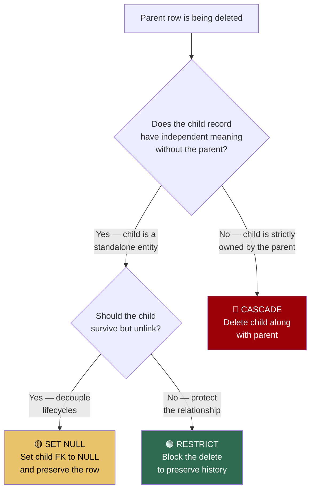
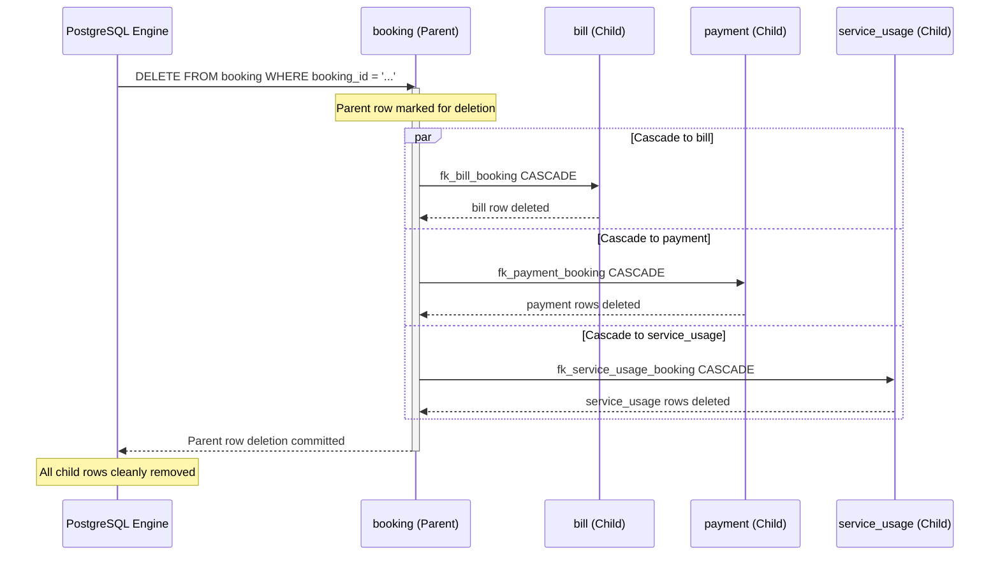

# PostgreSQL Foreign Key `ON DELETE` Actions & Architectural Rationale

This document provides an in-depth reference for understanding PostgreSQL referential actions (`ON DELETE`), how they safeguard database integrity, and the architectural reasoning behind their assignment in the **SkyNest Hotel Management System** (`db/schema/02_constraints.sql`).

---

## 1. Fundamentals of Referential Integrity

A **Foreign Key (FK)** creates a parent-child relationship between two tables, ensuring that a column in a child table strictly references an existing primary key or unique key in a parent table.

### The Parent Deletion Dilemma
When a row in the parent table is deleted, any child records pointing to that parent are left with invalid references. Relational Database Management Systems (RDBMS) prevent this "orphaning" by enforcing referential actions specified in the `ON DELETE` clause.

---

## 2. Core `ON DELETE` Options Explained

PostgreSQL supports five referential actions when a referenced parent row is deleted:

### A. `ON DELETE RESTRICT`
* **Mechanism**: Immediately blocks the `DELETE` statement if any referencing child rows exist. The transaction fails and PostgreSQL throws a foreign key violation error.
* **Timing**: Checked immediately when the statement executes (cannot be deferred to transaction end, unlike default `NO ACTION`).
* **Best Used For**: Critical assets, master entities, legal/audit records, and financial transactions where accidental cascade deletions would be catastrophic.

### B. `ON DELETE CASCADE`
* **Mechanism**: Automatically propagates the `DELETE` to all referencing child rows. When the parent is deleted, all matching children are purged silently in the same transaction.
* **Best Used For**: Strict parent-child compositions (line-items of an invoice, junction/bridge tables, dependent configuration metadata) where child rows have zero independent meaning without the parent.

### C. `ON DELETE SET NULL`
* **Mechanism**: Retains the child row, but automatically updates the foreign key column to `NULL`.
* **Prerequisite**: The child foreign key column **must be nullable** (declared without `NOT NULL`).
* **Best Used For**: Optional associations and decoupled lifecycles where the child entity should outlive the parent (e.g., user accounts reassignable after a branch closes).

### D. `ON DELETE SET DEFAULT`
* **Mechanism**: Sets the child foreign key column to its default value defined in the table schema.
* **Prerequisite**: The foreign key column must have a valid `DEFAULT` that points to an existing parent row.

### E. `ON DELETE NO ACTION`
* **Mechanism**: Similar to `RESTRICT`, but deferrable. If declared as `DEFERRABLE INITIALLY DEFERRED`, PostgreSQL allows temporary violations within a transaction as long as integrity is satisfied before `COMMIT`.

---

## 3. Comparative Overview

| Option | Child Row Fate | Error Raised? | Danger Level | Primary Intent |
| :--- | :--- | :--- | :--- | :--- |
| **`RESTRICT`** | Preserved (Delete blocked) | **Yes** | Low | Protect master data & prevent accidental loss |
| **`CASCADE`** | **Deleted** automatically | No | **High** | Clean up dependent sub-components & junction links |
| **`SET NULL`** | Preserved (FK set to `NULL`) | No | Low | Decouple entity lifecycles while retaining records |
| **`SET DEFAULT`** | Preserved (FK set to `DEFAULT`)| No | Low | Fallback to a predefined generic entity |

### Decision Flowchart



---

## 4. SkyNest System: Line-by-Line Relationship Mapping

In SkyNest, constraint definitions are isolated in `db/schema/02_constraints.sql` for modularity and migration control. Here is the full rationale behind every foreign key:

| Action | Foreign Key Relationship | Tables Involved | Architectural & Business Reasoning |
| :--- | :--- | :--- | :--- |
| **`RESTRICT`** | `room` $\rightarrow$ `branch` | `room` $\rightarrow$ `branch` | **Asset Protection**: A branch cannot be deleted if physical rooms exist inside it. You must explicitly decommission or reassign rooms first. |
| **`RESTRICT`** | `room` $\rightarrow$ `room_type` | `room` $\rightarrow$ `room_type` | **Catalog Integrity**: Deleting a category like "Deluxe Suite" is prohibited while physical hotel rooms are configured as Deluxe Suites. |
| **`RESTRICT`** | `booking` $\rightarrow$ `guest` | `booking` $\rightarrow$ `guest` | **Audit & Legal Compliance**: A guest profile cannot be purged if they have existing booking records (past, present, or future). Financial and legal history must be preserved. |
| **`RESTRICT`** | `booking` $\rightarrow$ `room` | `booking` $\rightarrow$ `room` | **Reservation History**: Physical rooms cannot be deleted if reservations are booked against them. |
| **`RESTRICT`** | `service_usage` $\rightarrow$ `service` | `service_usage` $\rightarrow$ `service` | **Billing History Protection**: You cannot delete a service (e.g. "Airport Shuttle") if past guests consumed it. (To retire a service, use soft-delete `is_active = FALSE` instead of deleting the row). |
| **`CASCADE`** | `room_rate` $\rightarrow$ `branch`, `room_type` | `room_rate` $\rightarrow$ `branch`, `room_type` | **Dependent Pricing**: A rate entry only exists to store the price of a `(branch, room_type)` pair. If either parent is removed, the rate has no meaning. |
| **`CASCADE`** | `room_amenity` $\rightarrow$ `room_type`, `amenity` | `room_amenity` $\rightarrow$ `room_type`, `amenity` | **Junction Table Cleanup**: If an amenity (e.g. "Hair Dryer") or room type is removed, the mapping row should automatically disappear. |
| **`CASCADE`** | `bill` $\rightarrow$ `booking` | `bill` $\rightarrow$ `booking` | **Strict Composition (1:1)**: A bill cannot exist without its booking. Deleting a test/cancelled booking purges its invoice. |
| **`CASCADE`** | `payment` $\rightarrow$ `booking` | `payment` $\rightarrow$ `booking` | **Strict Composition (1:M)**: Payments are installments tied directly to a booking. Deleting the booking purges its payment ledger. |
| **`CASCADE`** | `service_usage` $\rightarrow$ `booking` | `service_usage` $\rightarrow$ `booking` | **Lifecycle Ownership**: If a booking is deleted, the logged service orders tied to that stay are discarded. |
| **`SET NULL`** | `user_account` $\rightarrow$ `guest` | `user_account` $\rightarrow$ `guest` | **Decoupled Identity**: If a guest's profile is deleted, their login credentials and auth history are not violently deleted; `guest_id` simply becomes `NULL`. |
| **`SET NULL`** | `user_account` $\rightarrow$ `branch` | `user_account` $\rightarrow$ `branch` | **Staff Reassignment**: If a hotel branch closes, staff user accounts (managers, receptionists) must not be destroyed. Their `branch_id` becomes `NULL` so an administrator can reassign them to another branch. |

---

## 5. Practical Walkthroughs

### Walkthrough 1: Accidental Destruction Prevented by `RESTRICT`

```sql
-- Attempting to delete a hotel branch with existing rooms
DELETE FROM branch WHERE city = 'Colombo';
```
* **Result**:
  ```text
  ERROR: update or delete on table "branch" violates foreign key constraint "fk_room_branch" on table "room"
  DETAIL: Key (branch_id)=(550e8400-e29b-41d4-a716-446655440000) is still referenced from table "room".
  ```
* **Protection**: The developer or administrator is forced to consciously decide what to do with the Colombo rooms (reassign them or explicitly decommission them) rather than allowing the database to drop them.

---

### Walkthrough 2: Clean Cascade Deletion on Purging a Booking

```sql
-- Purging a test reservation
DELETE FROM booking WHERE booking_id = 'b7324317-0e69-42b7-87d4-e6a6953eb63a';
```
* **Execution Flow**:
  1. Row is deleted from `booking`.
  2. `bill` row for this booking is automatically deleted (`fk_bill_booking ON DELETE CASCADE`).
  3. All rows in `payment` for this booking are automatically deleted (`fk_payment_booking ON DELETE CASCADE`).
  4. All logged service orders in `service_usage` are automatically deleted (`fk_service_usage_booking ON DELETE CASCADE`).
* **Integrity**: Zero orphan rows remain in the billing or payment ledger.



---

### Walkthrough 3: Staff Account Preservation via `SET NULL`

```sql
-- Closing a branch
DELETE FROM branch WHERE branch_id = '8f32145b-321a-4d76-90ab-1234567890ab';
```
* **Execution Flow**:
  * Front desk staff `user_account` records are not deleted.
  * Their `branch_id` column is automatically set to `NULL`.
* **State of the `user_account` table**:
  ```text
  account_id                           | email           | branch_id | role
  -------------------------------------+-----------------+-----------+-------------
  3c88019a-9e12-4f3b-b892-75d6e1fa0a11 | john@hotel.com  | NULL      | receptionist
  ```
* **Outcome**: John can still log in or be reassigned to another branch with `UPDATE user_account SET branch_id = '<new_branch_id>' WHERE account_id = '...';`.

---

## 6. Best Practices & Rules of Thumb

1. **Default to Safety**: If in doubt during schema design, start with **`RESTRICT`**. It is always easier to loosen constraints later than to recover data deleted by an over-aggressive `CASCADE`.
2. **Never Cascade Financial Master Records**: Tables like `guest`, `room`, and `service` must use `RESTRICT` to protect auditability.
3. **Soft Deletes vs. Physical Deletes**: In production systems, master catalog items (like hotel services or room types) should almost never be physically deleted (`DELETE FROM service...`). Use status flags such as `is_active = FALSE` instead.
4. **Column Nullability**: When choosing `SET NULL`, always confirm the child column allows `NULL`. If the column has `NOT NULL`, the database will throw an execution error upon parent deletion.
