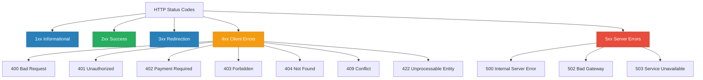

# HTTP Status Codes & Error Handling Architecture

In modern RESTful APIs, **HTTP status codes** are the standardized language through which the server communicates the outcome of a client request. Rather than returning a generic success code with an error message hidden inside a JSON payload (an anti-pattern), a well-architected backend uses precise HTTP status codes to distinguish between syntactic failures, business-rule violations, security blocks, and infrastructure outages.

This guide provides a comprehensive breakdown of all HTTP error codes used in the **SkyNest Hotel Management System**, explains the most frequently used error codes in depth, and catalogs every possible error condition across the application.

---

## 1. HTTP Status Code Hierarchy

HTTP response codes are grouped into five standard classes defined by RFC 7231:



| Range | Category | Definition | Responsibility |
| :--- | :--- | :--- | :--- |
| **2xx** | **Success** | The action requested by the client was received, understood, and accepted. | N/A (Successful) |
| **4xx** | **Client Error** | The request contains bad syntax, invalid state, or cannot be fulfilled. | **Client's responsibility** to fix before retrying. |
| **5xx** | **Server Error** | The server failed to fulfill an apparently valid request due to internal error or crash. | **Server's responsibility**; developer/ops must investigate. |

---

## 2. Standard SkyNest Error Response Contract

According to [`docs/specs/02_api_contract.md`](../specs/02_api_contract.md), SkyNest standardizes all error payloads into a predictable JSON envelope:

### Single Error Detail (FastAPI `HTTPException`)
```json
{
  "detail": "Room is not available for selected dates (double-booking)"
}
```

### Validation Error Detail (FastAPI / Pydantic `422 Unprocessable Entity`)
```json
{
  "detail": [
    {
      "loc": ["body", "email"],
      "msg": "value is not a valid email address",
      "type": "value_error.email"
    }
  ]
}
```

---

## 3. Frequently Used Error Status Codes (The Core 6)

In daily web development and across the SkyNest backend, approximately **95% of all client errors** fall into six core codes:

### 1. `400 Bad Request` — Business Logic & State Preconditions
* **Meaning**: The request was formatted properly, but it violates a domain-specific business rule or an object state precondition.
* **Analogy**: A guest asks to check out of their room, but they never checked in yet. The front desk clerk cannot perform the checkout because the booking is in an invalid lifecycle state.
* **When SkyNest uses it**:
  - Transitioning a booking to `Checked-In` when its current status is not `Booked`.
  - Ordering room service for a booking that is `Cancelled` or `Checked-Out`.
  - Attempting to record a payment that exceeds the outstanding balance.
  - Submitting an invalid enum string (e.g., room status other than `Available`, `Occupied`, `Maintenance`).

### 2. `401 Unauthorized` — Identity & Authentication Failure
* **Meaning**: The user is anonymous, missing an identity token, or their credentials/token are invalid or expired.
* **Key Header**: The server must send `WWW-Authenticate: Bearer` with the response.
* **Analogy**: A visitor walks into a staff-only area without an ID badge, or shows an expired badge.
* **When SkyNest uses it**:
  - Submitting incorrect email or password to `POST /api/auth/login`.
  - Sending requests to protected routes without an `Authorization: Bearer <token>` header.
  - Supplying a JWT token whose signature is invalid or whose expiry timestamp (`exp`) has passed.
  - Token subject (`account_id`) no longer exists in PostgreSQL `user_account`.

### 3. `403 Forbidden` — Authorization & Permission Failure
* **Meaning**: The server **knows who the user is** (authenticated), but that user is **not allowed** to perform the requested action.
* **Difference from 401**: 401 is *"Who are you?"* while 403 is *"I know who you are, but you cannot touch this."*
* **Analogy**: A guest with a valid room keycard tries to swipe into the hotel manager's private executive safe. The keycard proves their identity, but they lack permission.
* **When SkyNest uses it**:
  - A `guest` attempts to call staff-only endpoints (e.g., `PATCH /api/rooms/{id}/status`).
  - A `receptionist` attempts to view monthly revenue audit reports reserved for `manager` and `admin`.
  - A guest attempts to fetch or edit a booking that belongs to a different guest.

### 4. `404 Not Found` — Resource Non-Existence
* **Meaning**: The server cannot find the requested resource identified by the URI or database key.
* **Analogy**: A guest asks for Room 909 in a hotel that only has 4 floors.
* **When SkyNest uses it**:
  - Requesting `GET /api/rooms/c4a6b2...` when no row matches that UUID.
  - Looking up a booking, guest profile, amenity, or bill that does not exist in PostgreSQL.
  - Updating a room where the update query returns `UPDATE 0`.

### 5. `409 Conflict` — State Collisions & Uniqueness Violations
* **Meaning**: The request could not be completed due to a conflict with the current state of the resource (unique constraint violation, concurrency collision, or temporal overlap).
* **Analogy**: Two customers try to reserve the exact same seat on an airplane at the exact same second.
* **When SkyNest uses it**:
  - **Double-Booking**: Attempting to book a room for dates that overlap with an existing active reservation (`check_in_date < existing.check_out AND check_out_date > existing.check_in`).
  - **Duplicate User**: Registering with an email address already stored in `user_account`.
  - **Duplicate Guest**: Creating a guest record with a National Identity Card (NIC) or Passport number already registered.

### 6. `422 Unprocessable Entity` — Schema & Data Type Validation
* **Meaning**: The request JSON is well-formed syntax, but the fields fail Pydantic data validation (wrong data type, missing required key, regex failure).
* **When SkyNest uses it**:
  - Sending `"capacity": "three"` when Pydantic expects an integer.
  - Sending `"email": "not-an-email"` when validated with `EmailStr`.
  - Omitting required fields (e.g., missing `room_id` in booking creation body).
  - Passing a string that is not a valid 36-character UUID string.

---

## 4. Specialized Error Codes Used in SkyNest

Beyond the standard six, SkyNest utilizes specialized HTTP status codes for domain-specific events:

### `402 Payment Required` — Financial Clearance Gate
* **Meaning**: Reserved for digital payment flows.
* **Why SkyNest uses it**: During `PATCH /api/bookings/{id}/checkout`, the checkout procedure checks `fn_get_outstanding_balance(booking_id)`. If there is an unpaid balance from room charges or room service, SkyNest raises `402 Payment Required`:
  ```json
  {
    "detail": "Outstanding balance of LKR 15,000.00 — payment required before checkout"
  }
  ```

### `405 Method Not Allowed` — HTTP Verb Mismatch
* **Meaning**: The endpoint exists, but the HTTP verb is unsupported (e.g., sending `POST /api/rooms` when only `GET` is defined).

### `500 Internal Server Error` — Uncaught Backend Failures
* **Meaning**: A generic catch-all for unhandled exceptions (e.g., PostgreSQL connection drops, database pool exhaustion, division by zero in unhandled business logic).

---

## 5. Comprehensive Application Error Matrix

The following table catalogs every possible error condition across the SkyNest API:

| HTTP Status | Triggering Endpoint | Condition / Trigger | Error Message (`detail`) |
| :---: | :--- | :--- | :--- |
| **`400`** | `PATCH /api/rooms/{id}/status` | Status string not in `{"Available", "Occupied", "Maintenance"}` | `"Invalid status. Must be one of: Available, Occupied, Maintenance"` |
| **`400`** | `POST /api/bookings` | `check_out_date` is on or before `check_in_date` | `"Invalid date range: check_out_date must be after check_in_date"` |
| **`400`** | `PATCH /api/bookings/{id}/checkin` | Current booking status is not `'Booked'` | `"Booking is not in 'Booked' status"` |
| **`400`** | `PATCH /api/bookings/{id}/checkout` | Current booking status is not `'Checked-In'` | `"Booking is not in 'Checked-In' status"` |
| **`400`** | `PATCH /api/bookings/{id}/cancel` | Booking is already `'Checked-In'` or `'Checked-Out'` | `"Cannot cancel a booking that is already checked in or checked out"` |
| **`400`** | `POST /api/services/usage` | Target booking is not in `'Checked-In'` status | `"Booking is not Checked-In"` |
| **`400`** | `POST /api/services/usage` | Requested service is currently marked inactive | `"Service is inactive"` |
| **`400`** | `POST /api/services/usage` | Service quantity requested is less than 1 | `"Quantity must be at least 1"` |
| **`400`** | `POST /api/payments` | Payment amount exceeds remaining balance | `"Amount exceeds outstanding balance"` |
| **`400`** | `POST /api/payments` | Payment method not in `Cash`, `Credit Card`, `Debit Card`, `Online Transfer` | `"Invalid payment method"` |
| **`400`** | `POST /api/payments` | Attempting payment against a cancelled booking | `"Cannot record payment for a cancelled booking"` |
| **`400`** | `GET /api/reports/revenue` | Query date range reversed (`from_date > to_date`) | `"from_date must be earlier than or equal to to_date"` |
| **`401`** | `POST /api/auth/login` | Email not found in `user_account` | `"Invalid credentials"` |
| **`401`** | `POST /api/auth/login` | Password does not match bcrypt hash | `"Invalid credentials"` |
| **`401`** | `GET /api/auth/me` | Missing `Authorization` header | `"Not authenticated"` |
| **`401`** | All Protected Routes | JWT expired (`pyjwt.ExpiredSignatureError`) | `"Invalid or expired token"` |
| **`401`** | All Protected Routes | Tampered / malformed token (`pyjwt.InvalidTokenError`) | `"Invalid or expired token"` |
| **`401`** | All Protected Routes | Token `sub` (`account_id`) not found in database | `"Invalid or expired token"` |
| **`402`** | `PATCH /api/bookings/{id}/checkout` | `bill.outstanding_balance > 0` | `"Outstanding balance of LKR {amount} — payment required before checkout"` |
| **`403`** | `PATCH /api/rooms/{id}/status` | User role is `guest` or `receptionist` | `"Role '{role}' is not authorised. Required: admin, manager"` |
| **`403`** | `POST /api/guests` | User role is `guest` | `"Role 'guest' is not authorised. Required: receptionist, manager, admin"` |
| **`403`** | `GET /api/bookings/{id}` | Guest requests booking belonging to someone else | `"You do not have permission to view this booking"` |
| **`403`** | `GET /api/reports/*` | User role is `receptionist` or `guest` | `"Role '{role}' is not authorised. Required: manager, admin"` |
| **`403`** | `POST /api/admin/users` | User role is not `admin` | `"Role '{role}' is not authorised. Required: admin"` |
| **`404`** | `GET /api/rooms/{id}` | No room found with provided UUID | `"Room {room_id} not found"` |
| **`404`** | `PATCH /api/rooms/{id}/status` | Room UUID does not exist | `"Room {room_id} not found"` |
| **`404`** | `GET /api/guests/{id}` | No guest record matching UUID | `"Guest {guest_id} not found"` |
| **`404`** | `GET /api/bookings/{id}` | No booking record matching UUID | `"Booking {booking_id} not found"` |
| **`404`** | `GET /api/billing/{booking_id}` | No bill generated for given booking | `"Bill for booking {booking_id} not found"` |
| **`404`** | `POST /api/services/usage` | Service ID does not exist | `"Service {service_id} not found"` |
| **`409`** | `POST /api/auth/register` | Email already exists in `user_account` | `"An account with this email already exists"` |
| **`409`** | `POST /api/guests` | NIC / Passport number already exists in `guest` | `"NIC/Passport already exists"` |
| **`409`** | `POST /api/bookings` | Double-booking trigger detected date overlap | `"Room is not available for selected dates (double-booking)"` |
| **`422`** | All JSON Endpoints | Missing mandatory field in request body | `[{"loc": ["body", "field"], "msg": "field required"}]` |
| **`422`** | All JSON Endpoints | Type mismatch (e.g. integer passed as string) | `[{"loc": ["body", "field"], "msg": "value is not a valid integer"}]` |
| **`422`** | `POST /api/auth/register` | Malformed email syntax | `[{"loc": ["body", "email"], "msg": "value is not a valid email address"}]` |
| **`422`** | All Path Params | Invalid UUID format in URL path | `[{"loc": ["path", "room_id"], "msg": "value is not a valid uuid"}]` |
| **`500`** | Any Endpoint | PostgreSQL connection pool timeout / exhausted | `"Internal server error"` |
| **`500`** | Any Endpoint | Unhandled database trigger exception | `"Internal server error"` |

---

## 6. Critical Distinctions: Avoiding Common Mistakes

### 1. `401 Unauthorized` vs. `403 Forbidden`

| Dimension | `401 Unauthorized` | `403 Forbidden` |
| :--- | :--- | :--- |
| **Question Asked** | *"Who are you?"* | *"What are you allowed to do?"* |
| **Authentication State** | User is **unauthenticated** (missing, bad, or expired token). | User is **authenticated**, but lacks necessary role/permission. |
| **Client Action** | Prompt user to log in or refresh token. | Display "Access Denied" or disable action in UI. |
| **SkyNest Code** | [`get_current_user()`](../app/dependencies.py#L41) | [`require_role()`](../app/dependencies.py#L107) |

---

### 2. `400 Bad Request` vs. `422 Unprocessable Entity`

* **`422` (Syntax & Schema)**: The request payload failed **structure/type validation** before your business logic ever ran. FastAPI/Pydantic rejects the request automatically.
* **`400` (Semantics & Business Logic)**: The request payload is structurally valid (correct types, valid UUIDs, valid dates), but violates **business rules or lifecycle states** in your application logic.

```
Incoming Request
      │
      ▼
[Pydantic Validation]  ── Invalid Type/Missing Key ──>  422 Unprocessable Entity
      │
      ▼ (Valid Schema)
[Router / Business Logic] ── Invalid Status/State ───>  400 Bad Request
```

---

### 3. `400 Bad Request` vs. `409 Conflict`

* Use **`409 Conflict`** when the error is caused by a **collision with existing database state** that the client might resolve by reloading data (e.g. unique constraint collision, double-booking date collision).
* Use **`400 Bad Request`** when the request itself contains internally contradictory or unacceptable parameters (e.g. `check_out` earlier than `check_in`).

---

## 7. Frontend Integration Strategy (React + Vite)

The frontend uses the HTTP status code to determine what action to take:

```typescript
// Example: Centralized Axios / Fetch Response Interceptor
apiClient.interceptors.response.use(
  (response) => response,
  (error) => {
    const status = error.response?.status;
    const detail = error.response?.data?.detail;

    switch (status) {
      case 401:
        // Token expired or invalid -> Clear auth and redirect to login
        authStore.logout();
        window.location.href = '/login';
        break;

      case 402:
        // Payment required -> Open billing checkout modal
        toast.warning(detail);
        navigate(`/billing/${bookingId}/checkout`);
        break;

      case 403:
        // Forbidden -> Show permission denied toast
        toast.error("You do not have permission to perform this action.");
        break;

      case 404:
        toast.error(detail || "Requested item not found.");
        break;

      case 409:
        // Conflict -> Resource already exists or double-booking
        toast.error(`Conflict: ${detail}`);
        break;

      case 422:
        // Validation error -> Show field-specific error messages
        displayFieldValidationErrors(detail);
        break;

      case 500:
      default:
        toast.error("An unexpected server error occurred. Please try again later.");
        break;
    }
    return Promise.reject(error);
  }
);
```

---

## 8. Summary Checklist for Backend Developers

When writing endpoints in SkyNest:

1. ✅ **Never return HTTP 200 with an error object** like `{"success": false, "error": "..."}`.
2. ✅ **Use `status.HTTP_401_UNAUTHORIZED`** only when authentication fails (token missing or invalid).
3. ✅ **Use `status.HTTP_403_FORBIDDEN`** when role checks fail in [`require_role()`](../app/dependencies.py#L107).
4. ✅ **Use `status.HTTP_404_NOT_FOUND`** whenever a record lookup by ID returns `None` or `UPDATE 0`.
5. ✅ **Use `status.HTTP_409_CONFLICT`** for unique constraint collisions (email, NIC) and double-booking overlaps.
6. ✅ **Use `status.HTTP_402_PAYMENT_REQUIRED`** when outstanding balances block checkout.
7. ✅ **Always provide clear, actionable `detail` strings** so the frontend can display helpful error messages.
