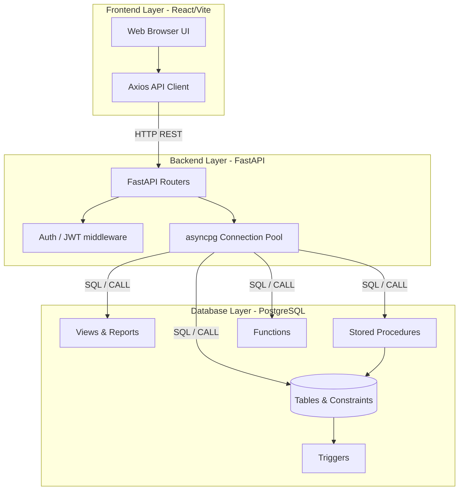
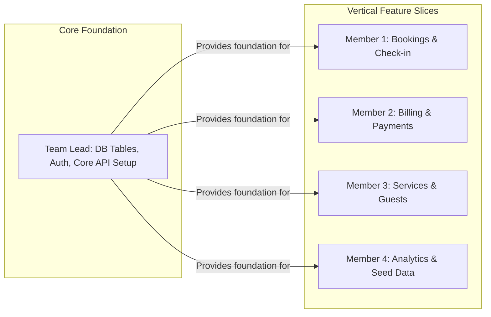

# System Architecture & Work Division Strategy

## 1. High-Level Architecture

SkyNest follows a classic 3-tier architecture, but with a heavy emphasis on the Database layer to align with the DBMS module evaluation criteria. 

## 2. The "Vertical Slicing" Work Division Strategy

Instead of dividing work horizontally by layer (e.g., Person A does all SQL, Person B does all Python), we use **Vertical Slicing**. 

Each team member takes ownership of a specific **Functional Subsystem**. They write the Database Logic (SQL) for that subsystem AND the Backend API (Python) that exposes it.

### Why this is the best approach for the Viva and your learning:
1. **End-to-End Understanding:** You will learn how data flows from a database table, through a Python API, back to the user.
2. **Independence:** You won't be blocked waiting for someone else to finish their part. You own your feature completely.
3. **Viva Defense:** When asked "What did you do?", you can proudly explain an entire working feature, not just disjointed snippets of code.

