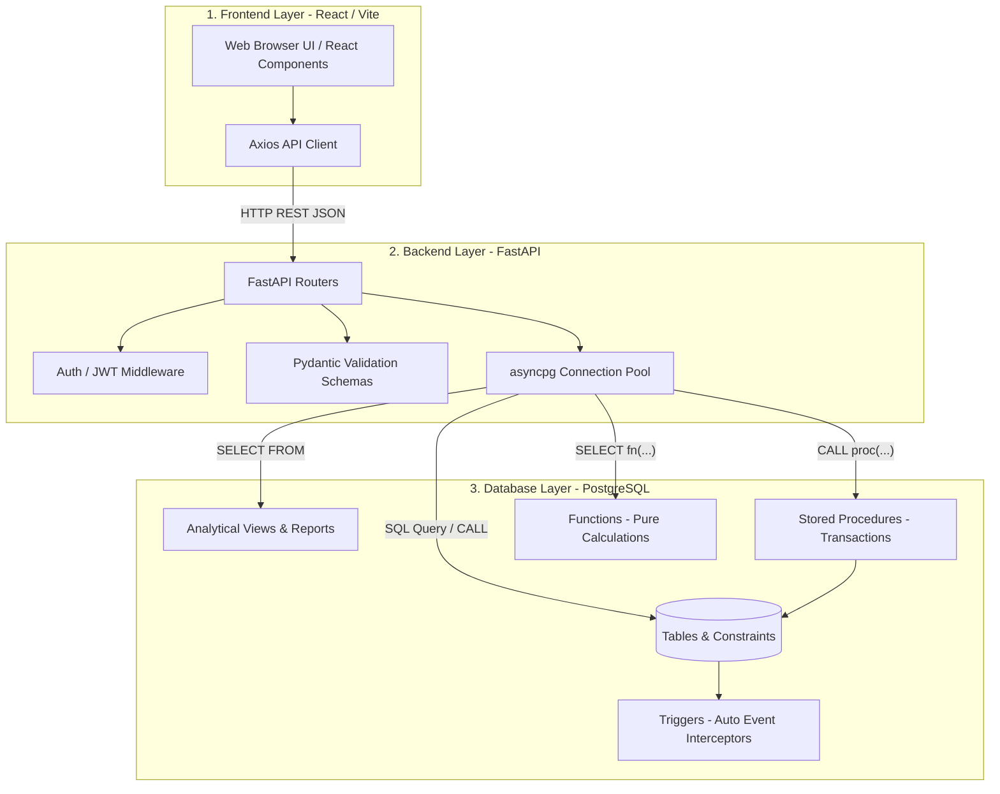
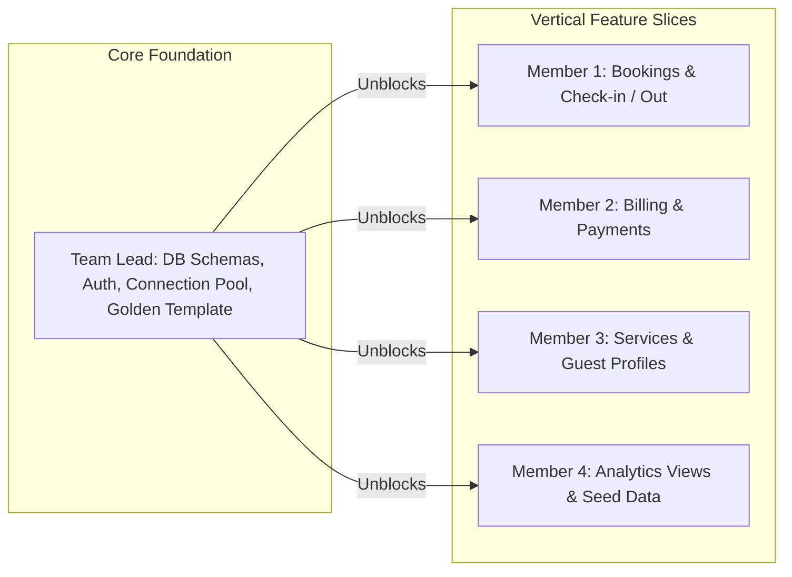

# System Architecture & Work Division Strategy

Welcome to the **SkyNest Architecture Guide**!  
This document explains the overarching system architecture, how the frontend, backend, and database interact, and how our work is divided among the 5 team members using **Vertical Slicing**.

---

## Quick Navigation & Reference Guides
- [Project README & Local Setup](../../README.md)
- [SkyNest Technical Learning Guide (Theory & Core Concepts)](./learn.md) — *Recommended for all beginners!*
- [Golden Reference Router (rooms.py)](../../backend/app/routers/rooms.py) — *Inspect this reference implementation before writing any router!*

### Team Member Assignment Guides
| Member | Role & Subsystem | Assignment Document | Checklist |
| :--- | :--- | :--- | :--- |
| **Sithum (Team Lead)** | System Architect, Core DDL, Auth & Golden Template | [sithum.md](./sithum/sithum.md) | [todo.md](./sithum/todo.md) |
| **Vinuji** | Reservation & Front Desk (Bookings, Check-in/out, Double-booking prevention) | [vinuji.md](./vinuji/vinuji.md) | [todo.md](./vinuji/todo.md) |
| **Sheereen** | Billing & Payments (Rate/Tax calculation, Invoices, Payment recording) | [sheereen.md](./sheereen/sheereen.md) | [todo.md](./sheereen/todo.md) |
| **Chamika** | Rooms, Amenities & Services (Rate lookup, Price snapshot trigger, Guest profiles) | [chamika.md](./chamika/chamika.md) | [todo.md](./chamika/todo.md) |
| **Sadeepa** | Analytics, Views & Seed Data (Occupancy/Revenue reports, Sample test data) | [sadeepa.md](./sadeepa/sadeepa.md) | [todo.md](./sadeepa/todo.md) |

---

## 1. High-Level 3-Tier Architecture

SkyNest follows a classic **3-Tier Architecture**, designed specifically to fulfill the requirements of the University DBMS module evaluation:



---

## 2. The "Vertical Slicing" Work Division Strategy

Instead of dividing work horizontally by layer (e.g. Person A writes all SQL, Person B writes all Python), we use **Vertical Slicing**.

Each team member owns a specific **Functional Subsystem**. They write:
1. The **Database Logic** (SQL procedures, functions, triggers, or views) for that feature.
2. The **Pydantic Schemas** (request validation and response shaping).
3. The **FastAPI Router** (API endpoints connecting the HTTP layer to their database logic).



### Why this is the best approach for the Viva and your learning:
1. **End-to-End Mastery**: You understand exactly how data flows from user input in the browser, through Pydantic models, into a stored procedure, and onto disk in PostgreSQL.
2. **True Independence**: You don't have to wait for someone else to write an API for your SQL, or vice versa. You own your entire subsystem.
3. **Viva Defense**: When examiners ask *"What was your individual contribution?"*, you can explain a complete, functional subsystem from database tables to API endpoints with full confidence.

---

## 3. Subsystem Interaction Matrix

The subsystems are not isolated; they interact cleanly through well-defined database and API boundaries:

```
[Member 1: Bookings] ──────── calls ───────► [Member 3: Rate Lookup]
(create_booking)                             (fn_get_current_rate)
       │
       ▼
[Member 1: Check-in/out]
(perform_checkout)
       │
       ▼ triggers
[Member 2: Billing]  ◄────── reads usage ─── [Member 3: Services]
(generate_bill)                              (service_usage table)
       │
       ▼
[Member 2: Payments]
(record_payment)
       │
       ▼ aggregated by
[Member 4: Analytics Views]
(v_monthly_revenue, v_room_occupancy, v_top_services)
```

---

## 4. Layer Communication Standard

To keep our codebase clean and maintainable, all team members must follow these rules:

1. **Keep Business Logic in the Database**:
   - Don't compute taxes or nights stayed in Python. Put calculations in [db/functions/](../../db/functions/).
   - Don't run multi-statement updates from Python if they need to be atomic. Put multi-step transactions in [db/procedures/](../../db/procedures/).
2. **Prevent Invalid States with Triggers**:
   - Double booking prevention must be handled by [double_booking_trigger.sql](../../db/triggers/double_booking_trigger.sql).
   - Price snapshotting must be handled by [service_usage_trigger.sql](../../db/triggers/service_usage_trigger.sql).
3. **Use Pydantic for Input Guards**:
   - Validate dates, strings, and numbers before they ever reach the database.
   - Use `from_attributes = True` on all response models.
4. **Never Hardcode Secrets**:
   - Use `backend/.env` for all database connection strings and JWT secrets.
5. **Always Reference the Golden Template**:
   - When in doubt about how to structure a router, consult [rooms.py](../../backend/app/routers/rooms.py)!
