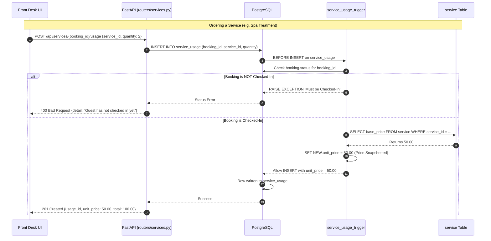

# Member 3 Assignment: Rooms, Amenities & Guest Services

**Assignee:** Chamika  
**Subsystem:** Dynamic Rate Lookup, Guest Profiles, Services Catalog, and Price Snapshotting Triggers  

> Start by reading the [README](../../README.md) (Git rules) and [architecture.md](./architecture.md) (how subsystems connect).  
> Reference the [Golden Template Router (rooms.py)](../../backend/app/routers/rooms.py) before writing your router.  
> Specs: [01_database_design](../specs/01_database_design.md) | [02_api_contract](../specs/02_api_contract.md) | [03_stored_procedures](../specs/03_stored_procedures_functions.md) | [04_triggers](../specs/04_triggers.md)

---

## Subsystem Overview & Business Logic

1. **Current Rate Lookup (`fn_get_current_rate`)**: Different branches charge different prices per room type. This function queries `room_rate` for a `(branch_id, room_type_id)` pair. Called by Vinuji's `create_booking` to freeze the daily rate at booking time.
2. **Guest Profile Management**: CRUD for `guest` table. Business rule: if `guest_type == 'Corporate'`, `company_name` is mandatory. Search by name, NIC/Passport, or email.
3. **Services Catalog & Usage**: Hotel amenities (Spa, Dining, Laundry, etc.). Receptionists add services to a guest's stay via `POST /api/services/{booking_id}/usage`.
4. **Price Snapshotting Trigger (`service_usage_trigger`)**: A `BEFORE INSERT` trigger on `service_usage` that:
   - Validates booking is `'Checked-In'` (prevents billing to past/future reservations).
   - Copies `base_price` from `service` table into `NEW.unit_price` (locks in price even if hotel changes it later).

---

## Files to Edit & Implementation Steps

```
Phase 1: Database Function & Trigger (SQL)  ──►  Phase 2: Backend Schemas (Pydantic)  ──►  Phase 3: Backend Routers (FastAPI)
- fn_get_current_rate.sql                        - schemas/guest.py                         - routers/guests.py
- service_usage_trigger.sql                                                                 - routers/services.py
```

### Phase 1: Database Layer (PostgreSQL)

#### 1. [fn_get_current_rate.sql](../../db/functions/fn_get_current_rate.sql)
- **Signature**: `fn_get_current_rate(p_branch_id UUID, p_room_type_id UUID) RETURNS NUMERIC(10,2)` — `STABLE`
- `SELECT daily_rate FROM room_rate WHERE branch_id = p_branch_id AND room_type_id = p_room_type_id;`

#### 2. [service_usage_trigger.sql](../../db/triggers/service_usage_trigger.sql)
- **Trigger**: `BEFORE INSERT ON service_usage FOR EACH ROW`
- **Function**: `trg_validate_service_usage()`
- **Logic**:
  1. Check `booking.status` — if not `'Checked-In'`, `RAISE EXCEPTION`.
  2. If `NEW.unit_price IS NULL OR NEW.unit_price = 0`, snapshot from `service.base_price`.
  3. `RETURN NEW;`
- **Trigger definition**:
  ```sql
  CREATE TRIGGER trg_service_usage
  BEFORE INSERT ON service_usage FOR EACH ROW
  EXECUTE FUNCTION trg_validate_service_usage();
  ```

---

### Phase 2: Backend Schemas (Pydantic)

#### 3. [schemas/guest.py](../../backend/app/schemas/guest.py)
- `GuestBase`: `full_name`, `nic_passport`, `email`, `phone`, `date_of_birth?`, `nationality?`, `gender?`, `guest_type` (default `"Individual"`), `company_name?`, `company_reg_number?`, `billing_contact_name?`. Model validator: require `company_name` when `guest_type == "Corporate"`.
- `GuestCreate`: Inherits `GuestBase`.
- `GuestUpdate`: Optional fields for partial updates.
- `GuestOut`: Inherits `GuestBase` + `guest_id: UUID`. Config: `from_attributes = True`.

---

### Phase 3: Backend Routers (FastAPI)

#### 4. [routers/guests.py](../../backend/app/routers/guests.py)
- `GET /api/guests` — Search (`?search=`) by name, NIC, or email. Role: `RECEPTIONIST/MANAGER/ADMIN`.
- `GET /api/guests/{guest_id}` — Detailed profile + booking history.
- `POST /api/guests` — Create guest, returns `201 Created`.
- `PUT /api/guests/{guest_id}` — Update guest details.

#### 5. [routers/services.py](../../backend/app/routers/services.py)
- `GET /api/services` — All active services (`WHERE is_active = TRUE`).
- `POST /api/services` — Create service. Role: `ADMIN/MANAGER`.
- `PATCH /api/services/{service_id}` — Update price or deactivate.
- `GET /api/services/{booking_id}/usage` — List services used for a booking with totals.
- `POST /api/services/{booking_id}/usage` — Body: `{service_id, quantity, notes?}`. Trigger auto-snapshots `unit_price` and validates `'Checked-In'` status. Catch trigger exception → `400 Bad Request`.

---

## Flow Diagram



---

## Testing (Optional — if you set up a local database)

1. **Rebuild**: `psql -U postgres -d skynest -f db/run_all.sql`
2. **Test `fn_get_current_rate`**:
   ```sql
   SELECT fn_get_current_rate(
       'a0000000-0000-0000-0000-000000000001',
       'b0000000-0000-0000-0000-000000000003'
   );
   ```
3. **Test trigger**:
   ```sql
   -- Should FAIL (booking in 'Booked' status):
   INSERT INTO service_usage (booking_id, service_id, quantity)
   VALUES ('e0000000-0000-0000-0000-000000000001', 'f0000000-0000-0000-0000-000000000001', 1);

   -- Should SUCCEED (booking in 'Checked-In' status, unit_price auto-filled):
   INSERT INTO service_usage (booking_id, service_id, quantity)
   VALUES ('e0000000-0000-0000-0000-000000000003', 'f0000000-0000-0000-0000-000000000001', 2);

   SELECT * FROM service_usage WHERE booking_id = 'e0000000-0000-0000-0000-000000000003';
   ```
4. **Test API**: Start backend (activate `.venv`, then run `uvicorn app.main:app --reload` in `backend/`), open [http://localhost:8000/docs](http://localhost:8000/docs).
