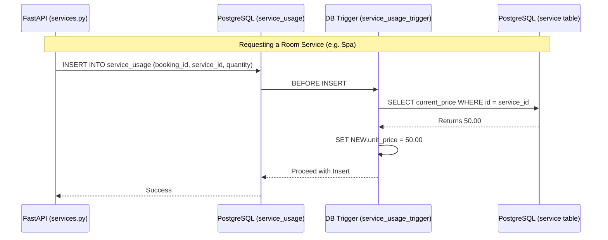

# Member 3 Assignment: Rooms, Amenities & Guest Services

**Role Summary:** You manage the master data for the hotel (rooms, services, amenities) and handle guest requests. You ensure that when a service is requested, the current price is locked in via triggers.

## Your Responsibilities (Files to Edit)

### 1. Database Layer (PostgreSQL)
* `db/functions/fn_get_current_rate.sql`: A function that retrieves the active rate for a specific room type at the current date.
* `db/triggers/service_usage_trigger.sql`: A crucial trigger that fires `BEFORE INSERT` on the `service_usage` table. It looks up the current price of the service from the `service` table and populates the `unit_price` column in `service_usage`. This guarantees price immutability.

### 2. Backend Layer (FastAPI Python)
* `backend/app/schemas/guest.py`: Pydantic models for guests and service requests.
* `backend/app/routers/guests.py`: Endpoints to register guests and look up their profiles.
* `backend/app/routers/rooms.py` (if not done by Team Lead): Endpoints to search for available rooms by branch, dates, and type.
* `backend/app/routers/services.py`: Endpoints to list available services and `POST /services/request` to record a guest using a service.

## Architecture & Flow

