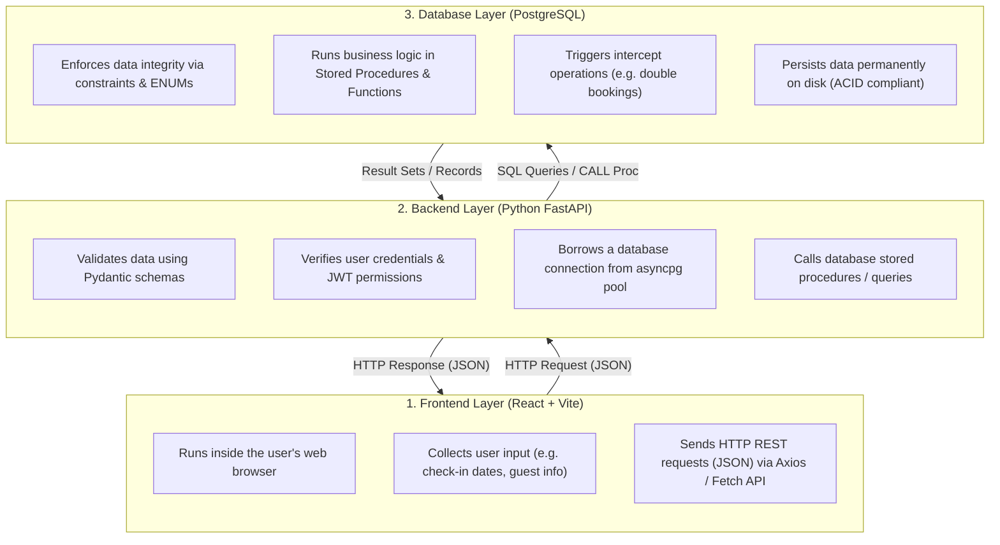
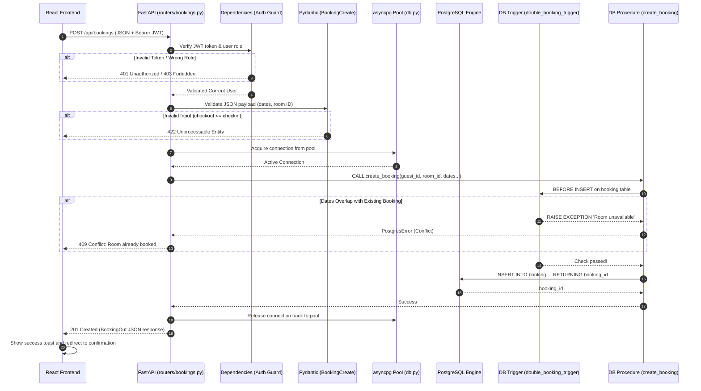

# SkyNest Technical Learning Guide (Theory & Core Concepts)

Welcome to the **SkyNest Technical Learning Guide**!  
This document is your beginner-friendly handbook. It explains the theoretical principles, terminology, and software design patterns behind every file you are creating in the SkyNest Hotel Management System.

Whether you are preparing to write your database procedures, building your first FastAPI endpoint, or getting ready to defend your code during the **DBMS Viva Examination**, this guide has everything you need.

---

## Table of Contents
1. [System Overview & The Request-Response Lifecycle](#1-system-overview--the-request-response-lifecycle)
2. [Database Layer (PostgreSQL)](#2-database-layer-postgresql)
   - [Schemas, Tables & DDL](#schemas-tables--ddl)
   - [Data Types & Custom ENUMs](#data-types--custom-enums)
   - [Native ENUM vs. Inline ENUM (Check Constraints)](#native-enum-vs-inline-enum-check-constraints)
   - [Integrity Constraints (PK, FK, UNIQUE, CHECK, NOT NULL)](#integrity-constraints)
   - [Database Indexing (B-Tree & Query Speed)](#database-indexing)
   - [SQL Functions vs. Stored Procedures](#sql-functions-vs-stored-procedures)
   - [Database Triggers (Automated Event Handlers)](#database-triggers)
   - [Analytical Views (Virtual Query Abstractions)](#analytical-views)
   - [Database Seeding](#database-seeding)
   - [ACID Properties in Hotel Management](#acid-properties-in-hotel-management)
   - [Database Security: Principle of Least Privilege](#database-security-principle-of-least-privilege)
   - [Viewing & Inspecting Tables and Data (GUI & CLI)](#viewing--inspecting-tables-and-data-gui--cli)
3. [Backend Layer (Python & FastAPI)](#3-backend-layer-python--fastapi)
   - [Client-Server Architecture & HTTP Protocol](#client-server-architecture--http-protocol)
   - [HTTP Methods (GET, POST, PATCH, PUT, DELETE)](#http-methods)
   - [HTTP Status Codes](#http-status-codes)
   - [Request Anatomy: Headers, Query Params, Path Params & Body](#request-anatomy)
   - [JSON (JavaScript Object Notation)](#json-javascript-object-notation)
   - [Data Validation & Serialization with Pydantic](#data-validation--serialization-with-pydantic)
   - [Modular Routing with FastAPI `APIRouter`](#modular-routing-with-fastapi-apirouter)
   - [Database Connection Pooling (`asyncpg`)](#database-connection-pooling)
   - [Environment Variables (`.env`) & Secrets Security](#environment-variables-and-secrets)
   - [Authentication & JWT (JSON Web Tokens)](#authentication--jwt)
   - [Password Hashing with `bcrypt`](#password-hashing-with-bcrypt)
   - [Role-Based Access Control (RBAC)](#role-based-access-control-rbac)
4. [Putting It All Together: Step-by-Step Scenario](#4-putting-it-all-together-step-by-step-scenario)

---

## 1. System Overview & The Request-Response Lifecycle

In modern web development, software is divided into distinct **layers (tiers)** to keep responsibilities clean and maintainable. SkyNest uses a **3-Tier Architecture**:



---

## 2. Database Layer (PostgreSQL)

The database is the **heart** of SkyNest. Rather than treating PostgreSQL as a passive storage dump, we leverage its advanced relational features to guarantee business rules even if someone tries to insert invalid data directly.

### Schemas, Tables & DDL
- **DDL (Data Definition Language)**: SQL statements like `CREATE TABLE`, `ALTER TABLE`, and `DROP TABLE` that define the database structure.
- **Table**: A structured collection of rows and columns representing a business entity (e.g. `room`, `guest`, `booking`, `bill`).
- In SkyNest, tables are defined in [`../../db/schema/01_tables.sql`](../../db/schema/01_tables.sql).

### Data Types & Custom ENUMs
Each column has a specific data type to ensure storage efficiency and correctness:
- `UUID`: Universally Unique Identifier (128-bit). We use UUIDs (e.g., `a0000000-0000-0000-0000-000000000001`) instead of simple integers (1, 2, 3) to prevent guessable ID attacks and allow distributed record creation.
- `VARCHAR(n)`: Variable-length character string up to *n* characters (e.g. `VARCHAR(100)` for email).
- `TEXT`: Variable-length string without an artificial limit (e.g. guest special notes).
- `NUMERIC(10, 2)`: Fixed-point decimal number with 10 total digits and 2 decimal places. **Never use floating point (`FLOAT` or `REAL`) for money** because binary floating-point representation suffers from rounding errors!
- `DATE`: Calendar date (`YYYY-MM-DD`).
- `TIMESTAMPTZ`: Timestamp with timezone awareness (`YYYY-MM-DD HH:MM:SS+TZ`).
- **ENUM (Enumerated Type)**: A custom type that restricts a column to a predefined set of string literals.
  *Example:*
  ```sql
  CREATE TYPE booking_status AS ENUM ('Booked', 'CheckedIn', 'CheckedOut', 'Cancelled');
  ```
  *Why use ENUMs?* It prevents typos like `'booked'`, `'BOOKED'`, or `'boked'`. PostgreSQL will reject any value not in the list at the database level!

### Native ENUM vs. Inline ENUM (Check Constraints)

During DBMS evaluations or code reviews, you may be asked: *"Why did you create custom ENUM types instead of using `VARCHAR` with a `CHECK` constraint?"*

Here is the technical comparison:

| Dimension | **Native PostgreSQL ENUM** (`CREATE TYPE`) | **Inline ENUM** (`VARCHAR` + `CHECK`) |
| :--- | :--- | :--- |
| **How it's created** | Created once globally in the database schema: <br>`CREATE TYPE booking_status AS ENUM ('Booked', 'Checked-In', 'Checked-Out', 'Cancelled');` | Defined directly on each table column: <br>`status VARCHAR(20) NOT NULL CHECK (status IN ('Booked', 'Checked-In', ...))` |
| **Internal Storage** | **4 bytes per row**: PostgreSQL stores an internal integer enum OID index on disk rather than the string literal. Highly storage and memory efficient. | Variable text bytes (e.g. 10–20 bytes per row + string length headers). |
| **Type Safety & Reusability** | **High**: Can be reused across multiple tables, function parameters, procedure signatures, and view columns with identical typing. | **Low**: The `CHECK` constraint list must be repeated on every table that uses it, risking inconsistencies if one table's constraint is modified and another is forgotten. |
| **Modifying Allowed Values** | Adding values is supported (`ALTER TYPE booking_status ADD VALUE 'No-Show';`). However, removing or renaming a value requires recreating the type or catalog modifications. | Modifying values is simple: drop the existing constraint and add a new one (`ALTER TABLE booking DROP CONSTRAINT ...`). |
| **Database Portability** | PostgreSQL-specific feature. (MySQL has inline column ENUMs; SQLite has no ENUM data type). | Standard ANSI SQL. Portable across PostgreSQL, MySQL, SQLite, Oracle, and MS SQL Server. |

> [!TIP]
> **Viva / Interview Summary:**  
> SkyNest uses **Native ENUMs** because they enforce strict database-level type safety across our stored procedures and functions, eliminate typos across relational tables, and save index storage by encoding values in 4 bytes instead of arbitrary text strings.

### Integrity Constraints
Constraints are rules enforced on data columns by PostgreSQL. They are defined in [`../../db/schema/02_constraints.sql`](../../db/schema/02_constraints.sql).

1. **Primary Key (PK)**:
   - Uniquely identifies each row in a table.
   - Cannot be `NULL` and cannot contain duplicate values.
   - Example: `booking_id UUID PRIMARY KEY`.

2. **Foreign Key (FK)**:
   - Enforces **Referential Integrity** between two tables. A foreign key in Table B refers to the Primary Key of Table A.
   - Example: `booking.room_id REFERENCES room(room_id)`.
   - Actions:
     - `ON DELETE RESTRICT`: Prevents deleting a parent room if active bookings reference it.
     - `ON DELETE CASCADE`: Deleting a parent automatically deletes child rows (use with caution, e.g. deleting a bill deletes child payments).

3. **NOT NULL**:
   - Requires that a column must always have a value when a row is created.
   - Example: `check_in_date DATE NOT NULL`.

4. **UNIQUE**:
   - Ensures that all values in a column (or combination of columns) are distinct.
   - Example: `UNIQUE (email)` on `user_account` prevents two users from registering with the same email.
   - Example: `UNIQUE (branch_id, room_number)` ensures Room 101 can exist in Colombo and Room 101 can exist in Kandy, but Colombo cannot have two Room 101s!

5. **CHECK**:
   - Evaluates a boolean expression on every `INSERT` and `UPDATE`. If false, the operation fails.
   - Example:
     ```sql
     ALTER TABLE booking ADD CONSTRAINT chk_booking_dates 
     CHECK (check_out_date > check_in_date);
     ```
     This mathematically guarantees that nobody can check out before they check in!

### Database Indexing
Imagine a 1,000-page hotel guest directory. Without an alphabetical index at the back, finding "Perera, Kamal" would require reading all 1,000 pages one-by-one (**Full Table Scan** — $O(N)$ time complexity).

An **Index** is an auxiliary data structure (typically a **B-Tree** / Balanced Tree) maintained on disk by PostgreSQL:
- Allows finding matching rows in $O(\log N)$ time.
- Defined in [`../../db/schema/03_indexes.sql`](../../db/schema/03_indexes.sql).
- **What should be indexed?**
  1. Columns frequently used in `WHERE` clauses (e.g. `status`, `check_in_date`).
  2. Foreign keys (e.g. `booking.guest_id`) to accelerate `JOIN` queries.
  3. Columns used in `ORDER BY` and sorting.
- **The Trade-off**: Indexes make `SELECT` queries lightning fast, but slightly slow down `INSERT`, `UPDATE`, and `DELETE` because the B-Tree must be updated whenever data changes.

### SQL Functions vs. Stored Procedures
PostgreSQL allows writing procedural logic in **PL/pgSQL**. Knowing the difference is a favorite Viva question!

| Feature | SQL Function (`CREATE FUNCTION`) | Stored Procedure (`CREATE PROCEDURE`) |
| :--- | :--- | :--- |
| **Primary Purpose** | Compute and return a value or table | Execute a workflow / business transaction |
| **How It Is Called** | In a `SELECT` statement: `SELECT fn_calculate_nights(...)` | Using the `CALL` statement: `CALL create_booking(...)` |
| **Return Value** | Must return a value (`RETURNS NUMERIC`, `RETURNS TABLE`) | Does not return a value (uses `OUT` parameters instead) |
| **Transaction Control** | **Cannot** manage transactions (`COMMIT`/`ROLLBACK` forbidden) | **Can** manage transactions (explicit `COMMIT`/`ROLLBACK` allowed) |
| **Location in SkyNest** | [`../../db/functions/`](../../db/functions/) | [`../../db/procedures/`](../../db/procedures/) |
| **SkyNest Examples** | `fn_calculate_nights`, `fn_calculate_tax`, `fn_get_current_rate` | `create_booking`, `perform_checkin`, `generate_bill`, `record_payment` |

### Database Triggers
A **Trigger** is an automatic event handler inside the database. It is triggered by an event (`INSERT`, `UPDATE`, or `DELETE`) on a specific table.
Triggers are defined in [`../../db/triggers/`](../../db/triggers/).

```
SQL Operation (e.g. INSERT INTO booking)
                 │
                 ▼
       ┌───────────────────┐
       │   BEFORE Trigger  │ ──► Checks rules (e.g. trg_prevent_double_booking)
       └───────────────────┘     Can RAISE EXCEPTION to cancel the operation!
                 │
                 ▼
       [ Row written to table ]
                 │
                 ▼
       ┌───────────────────┐
       │   AFTER Trigger   │ ──► Synchronizes related state (e.g. room_status)
       └───────────────────┘
```

- **Special Variables inside Triggers**:
  - `NEW`: A record variable holding the new data row being inserted or updated.
  - `OLD`: A record variable holding the original data row before an update or delete.
- **SkyNest Trigger Examples**:
  1. [`../../db/triggers/double_booking_trigger.sql`](../../db/triggers/double_booking_trigger.sql): Fires `BEFORE INSERT` on `booking`. Queries existing bookings for overlapping dates. If found, executes `RAISE EXCEPTION` to abort the transaction!
  2. [`../../db/triggers/service_usage_trigger.sql`](../../db/triggers/service_usage_trigger.sql): Fires `BEFORE INSERT` on `service_usage`. Looks up the current price in `service` and sets `NEW.unit_price`. This **snapshots** the price so future price changes do not alter past bills!
  3. [`../../db/triggers/room_status_trigger.sql`](../../db/triggers/room_status_trigger.sql): Fires `AFTER UPDATE` on `booking`. When `status` changes to `'CheckedIn'`, it automatically updates `room.status = 'Occupied'`.

### Analytical Views
A **VIEW** is a stored, virtual query. It acts like a read-only table, but stores no data itself; when you query a view, PostgreSQL runs the underlying SQL query behind the scenes.
Views are defined in [`../../db/views/reports.sql`](../../db/views/reports.sql).

- **Why use Views?**
  - Consolidates complex `JOIN`s, `GROUP BY`s, and Window functions (`RANK()`, `SUM() OVER (...)`).
  - Keeps SQL query complexity in the database layer rather than cluttering Python backend code.
  - Example: The manager frontend can simply query:
    ```sql
    SELECT * FROM v_room_occupancy WHERE branch_name = 'SkyNest Colombo';
    ```

### Database Seeding
**Seeding** is the process of populating the database with realistic initial data for development and testing.
The master seed file is [`../../db/seed/sample_data.sql`](../../db/seed/sample_data.sql).

- Why realistic seed data matters:
  1. Allows team members to test API endpoints immediately without manual data entry.
  2. Enables testing of edge cases (e.g. overlapping booking attempts, unpaid balances, multi-day stays).
  3. Pre-configures user accounts with known passwords for login testing.

### ACID Properties in Hotel Management
PostgreSQL is a fully **ACID-compliant** Relational Database Management System (RDBMS):
- **A — Atomicity**: "All or Nothing". When recording a payment and updating the bill's outstanding balance, both must succeed. If the server loses power midway, the entire operation is rolled back.
- **C — Consistency**: The database must transition from one valid state to another. Constraints (`CHECK`, `FK`) are never violated.
- **I — Isolation**: Concurrent transactions do not interfere with each other. If Vinuji and Chamika attempt to book the last available Deluxe room at the exact same millisecond, isolation mechanisms ensure one transaction succeeds and the other receives a conflict error.
- **D — Durability**: Once a transaction is committed, changes are written to the Write-Ahead Log (WAL) on disk and survive server restarts.

### Database Security: Principle of Least Privilege
The **Principle of Least Privilege (PoLP)** dictates that any module, user, or process should possess only the minimum privileges necessary to perform its intended function.

- **Why we never use the `postgres` superuser in applications:**
  The `postgres` superuser has unrestricted access across your entire computer's database cluster: it can drop any database, read/modify catalog tables, create/delete users, and even read files from the host operating system using administrative functions. If a web application uses the `postgres` superuser, an SQL Injection vulnerability could compromise the entire server.
- **The Dedicated Project User (`skynest_user`):**
  SkyNest creates a dedicated database user `skynest_user` that owns and accesses **only** the `skynest` database. Even if the password was leaked, an attacker could not access any other database or perform system-level operations.
- **How Team Development Works Locally:**
  In a distributed university project, each team member installs PostgreSQL on their **own computer** and manages their own local database instance. Team members do not connect across the internet to the Team Lead's computer, and members never share personal master passwords.

### Viewing & Inspecting Tables and Data (GUI & CLI)
As you develop backend endpoints and SQL procedures, you will constantly need to verify that data was inserted or modified correctly. Here are the primary tools:

1. **pgAdmin 4 (Official GUI):**
   - Automatically bundled with the PostgreSQL installer on Windows.
   - Navigate to: `Servers` &rarr; `PostgreSQL 18` &rarr; `Databases` &rarr; `skynest` &rarr; `Schemas` &rarr; `public` &rarr; `Tables`.
   - Right-click any table &rarr; **View/Edit Data** &rarr; **All Rows** to view an interactive spreadsheet of rows.
   - Click the **Query Tool** (lightning bolt) to run ad-hoc queries (`SELECT * FROM booking WHERE status = 'Booked';`).

2. **VS Code Database Extensions (Integrated Developer Experience):**
   - Install the **Database Client** extension (by *cweijan*) in VS Code.
   - Connect using Host: `localhost`, Port: `5432`, Database: `skynest`, User: `skynest_user`.
   - Allows browsing tables, viewing rows, and executing queries without ever switching away from your code editor.

3. **DBeaver Community Edition (Universal Free GUI):**
   - Download from [dbeaver.io](https://dbeaver.io/). A lightweight, fast tool widely preferred in industry.

4. **Terminal / Command-Line Interface (`psql`):**
   - Fast, keyboard-only inspection directly inside your terminal:
     - `\dt` &mdash; List all public tables.
     - `\d table_name` &mdash; Describe table schema (columns, types, foreign keys).
     - `SELECT * FROM guest LIMIT 5;` &mdash; View rows directly.
     - `\q` &mdash; Exit psql.

---

## 3. Backend Layer (Python & FastAPI)

The backend acts as the secure intermediary between the user interface and the database. It handles authentication, validates user inputs, and executes database procedures.

### Client-Server Architecture & HTTP Protocol
Web communication operates over the **HTTP (Hypertext Transfer Protocol)**:
1. The **Client** (React frontend running in the browser) creates an **HTTP Request**.
2. The **Server** (FastAPI running on port 8000) parses the request, executes logic, and returns an **HTTP Response**.

```
Client (Browser)                              Server (FastAPI)
      │                                              │
      │ ─── HTTP Request (Method, URL, Body) ──────► │
      │                                              │ ──► [Query Database]
      │                                              │ ◄── [Receive Records]
      │ ◄── HTTP Response (Status Code, JSON) ────── │
```

### HTTP Methods
HTTP methods (often called "verbs") tell the server what action to perform:

| HTTP Method | Purpose | Idempotent? | Has Body? | SkyNest Example |
| :--- | :--- | :--- | :--- | :--- |
| `GET` | Retrieve data from the server | Yes (calling it multiple times has no side effects) | No | `GET /api/rooms` (List rooms) |
| `POST` | Create a new resource or trigger an action | No (calling twice creates two records) | Yes | `POST /api/bookings` (Make a booking) |
| `PATCH` | Partially update an existing resource | No | Yes | `PATCH /api/guests/{id}` (Update phone number) |
| `PUT` | Replace an entire resource | Yes | Yes | `PUT /api/services/{id}` (Update all service details) |
| `DELETE` | Remove a resource | Yes | Optional | `DELETE /api/amenities/{id}` (Remove amenity) |

### HTTP Status Codes
The server indicates the outcome of an HTTP request using standardized numerical codes:
- **`2xx` (Success)**:
  - `200 OK`: Standard success response.
  - `201 Created`: New resource was successfully created (used for `POST`).
  - `204 No Content`: Action succeeded, but there is no body to return.
- **`4xx` (Client Errors — User or Frontend made a mistake)**:
  - `400 Bad Request`: General malformed request.
  - `401 Unauthorized`: Missing or invalid authentication token (not logged in).
  - `403 Forbidden`: Authenticated, but your role lacks permission (e.g. a Guest trying to view manager reports).
  - `404 Not Found`: Requested resource (e.g. `/api/rooms/999`) does not exist.
  - `409 Conflict`: Business rule violation (e.g. room already booked for those dates).
  - `422 Unprocessable Entity`: Input failed Pydantic validation (e.g. invalid email format, checkout date before checkin date).
- **`5xx` (Server Errors — Bug in backend code or database down)**:
  - `500 Internal Server Error`: Unhandled Python exception or database crash.

### Request Anatomy
An HTTP request consists of four parts:
1. **URL & Path Parameters**:
   - `https://localhost:8000/api/bookings/{booking_id}`
   - The `{booking_id}` is a **Path Parameter** identifying a specific resource.
2. **Query Parameters**:
   - `https://localhost:8000/api/rooms?branch_id=123&is_available=true`
   - Key-value pairs after the `?` used for filtering, sorting, or pagination.
3. **Headers**:
   - Metadata about the request.
   - `Content-Type: application/json` tells the server the payload format.
   - `Authorization: Bearer <token>` passes the user's security token.
4. **Request Body**:
   - The JSON data payload sent in `POST`, `PUT`, or `PATCH` requests.

### JSON (JavaScript Object Notation)
JSON is the universal data exchange format of the modern web:
```json
{
  "guest_id": "c0000000-0000-0000-0000-000000000001",
  "room_id": "d0000000-0000-0000-0000-000000000002",
  "check_in_date": "2026-10-01",
  "check_out_date": "2026-10-05",
  "payment_option": "CreditCard"
}
```
- **Serialization**: Converting Python objects / database tuples into a JSON string to send over the network.
- **Deserialization**: Parsing an incoming JSON string into Python objects and types.

### Data Validation & Serialization with Pydantic
In Python, incoming JSON is just untrusted raw text. **Pydantic** is a library that validates data against strict Python type annotations.
Schemas are located in [`../../backend/app/schemas/`](../../backend/app/schemas/).

```python
from pydantic import BaseModel, model_validator
from datetime import date
from uuid import UUID

class BookingCreate(BaseModel):
    guest_id: UUID
    room_id: UUID
    check_in_date: date
    check_out_date: date
    payment_option: str

    @model_validator(mode="after")
    def validate_dates(self):
        if self.check_out_date <= self.check_in_date:
            raise ValueError("check_out_date must be after check_in_date")
        return self
```
- **Request Models (`Create`/`Update`)**: Define what fields the user must provide.
- **Response Models (`Out`/`Detail`)**: Define what fields are sent back to the user, stripping out sensitive internal fields (like password hashes).
- `from_attributes = True` (or `orm_mode`): Allows Pydantic models to automatically read data from `asyncpg.Record` database objects.

### Modular Routing with FastAPI `APIRouter`
Instead of placing dozens of endpoints in a single file, FastAPI uses `APIRouter` to split routes across feature-specific files in [`../../backend/app/routers/`](../../backend/app/routers/).

Each router handles one functional area:
- `rooms.py`: Room search, availability, CRUD (**The Golden Reference Template**).
- `auth.py`: Login, token generation, user registration.
- `bookings.py`: Reservation lifecycle, check-in, check-out.
- `billing.py`: Bill generation, payment recording.
- `guests.py`: Guest profiles and lookup.
- `services.py`: Service catalog and service orders.
- `reports.py`: Management analytics views.

In [`../../backend/app/main.py`](../../backend/app/main.py), all routers are mounted onto the main FastAPI application with their path prefixes (e.g. `/api/bookings`).

### Database Connection Pooling
Opening a new TCP connection to PostgreSQL takes 20–50 milliseconds. If 100 users visit the site at once, opening 100 separate connections can crash the database server.

A **Connection Pool** solves this:
- At server startup ([`../../backend/app/db.py`](../../backend/app/db.py)), `asyncpg.create_pool` opens a set of reusable connections (e.g., 5 to 20 connections) and keeps them warm.
- When an API request arrives:
  ```python
  async with get_connection() as conn:
      result = await conn.fetch("SELECT * FROM room WHERE...")
  ```
- The connection is temporarily borrowed from the pool, runs the query, and is instantly returned to the pool for the next request.

### Environment Variables and Secrets
Secrets (database passwords, JWT encryption keys) should **NEVER** be committed to Git.
- Configurations are stored in a local, uncommitted file: `backend/.env`.
- A template file, `backend/.env.example`, is committed to Git so teammates know what variables are expected.
- Loaded securely in Python via [`../../backend/app/config.py`](../../backend/app/config.py) using `pydantic-settings`.

### Authentication & JWT
SkyNest uses **Stateless Token-Based Authentication**:
1. User enters their email and password in the frontend.
2. Frontend sends `POST /api/auth/login`.
3. Backend checks the credentials. If valid, it generates a **JWT (JSON Web Token)**.
4. The JWT is returned to the frontend, which stores it in `localStorage` or `sessionStorage`.
5. For all subsequent requests, the frontend includes this token in the header:
   ```http
   Authorization: Bearer <token>
   ```

**Structure of a JWT**:
A JWT consists of three base64url-encoded parts separated by dots (`.`):
```
Header.Payload.Signature
```
- **Header**: Specifies the algorithm (e.g. `HS256`).
- **Payload**: Contains claims (data) about the user:
  ```json
  {
    "sub": "user-uuid-1234",
    "role": "MANAGER",
    "branch_id": "colombo-uuid",
    "exp": 1727616000
  }
  ```
- **Signature**: Formed by taking `HMAC-SHA256(Header + Payload, SECRET_KEY)`. Only someone with the secret key can create a valid signature. If an attacker modifies the role from `'GUEST'` to `'ADMIN'`, the signature check fails, and FastAPI rejects the request with `401 Unauthorized`!

### Password Hashing with `bcrypt`
Passwords must never be stored in plain text. If a database is leaked, plain passwords compromise every user.
We use **bcrypt**:
- **Salt**: A random string added to the password before hashing so identical passwords produce completely different hashes.
- **One-way function**: Computationally easy to hash, but mathematically impossible to reverse.
- Verification works by hashing the entered password with the stored salt and comparing hashes.
- Implemented in [`../../backend/app/auth.py`](../../backend/app/auth.py).

### Role-Based Access Control (RBAC)
Not all users have the same privileges. SkyNest defines 4 roles:
1. `ADMIN`: Full system access, branch creation, audit logs.
2. `MANAGER`: Can generate reports, manage rooms and rates in their assigned branch.
3. `RECEPTIONIST`: Can make bookings, perform check-in/check-out, record payments.
4. `GUEST`: Can view available rooms, book for themselves, and view their own bills.

In FastAPI, routes are protected using dependency injection in [`../../backend/app/dependencies.py`](../../backend/app/dependencies.py):
```python
@router.post("/rooms", dependencies=[Depends(require_role("MANAGER"))])
async def create_room(...):
    # Only managers (and admins) can reach this code!
```

---

## 4. Putting It All Together: Step-by-Step Scenario

Let's trace what happens when a guest clicks **"Confirm Booking"** in the web interface:



---

## Quick Tips for the DBMS Viva Examination
When presenting your subsystem to your lecturers:
1. **Explain the "Why", not just the "How"**:
   - Don't just say *"I wrote a trigger"*.
   - Say: *"I wrote a BEFORE INSERT trigger to guarantee that double bookings are physically impossible at the database engine level, ensuring ACID isolation."*
2. **Highlight Financial Precision**:
   - Point out that money is stored as `NUMERIC(10,2)` to prevent floating point inaccuracy.
   - Explain why `unit_price` in `service_usage` is snapshotted via a trigger to protect historical financial integrity.
3. **Show Separation of Concerns**:
   - Calculations belong in **SQL Functions** (`db/functions/`).
   - Atomic state changes belong in **Stored Procedures** (`db/procedures/`).
   - Validation belongs in **Pydantic Schemas** (`backend/app/schemas/`).
   - Web routing belongs in **FastAPI Routers** (`backend/app/routers/`).

---
*(Keep this guide open as you implement your personal assignment file!)*
