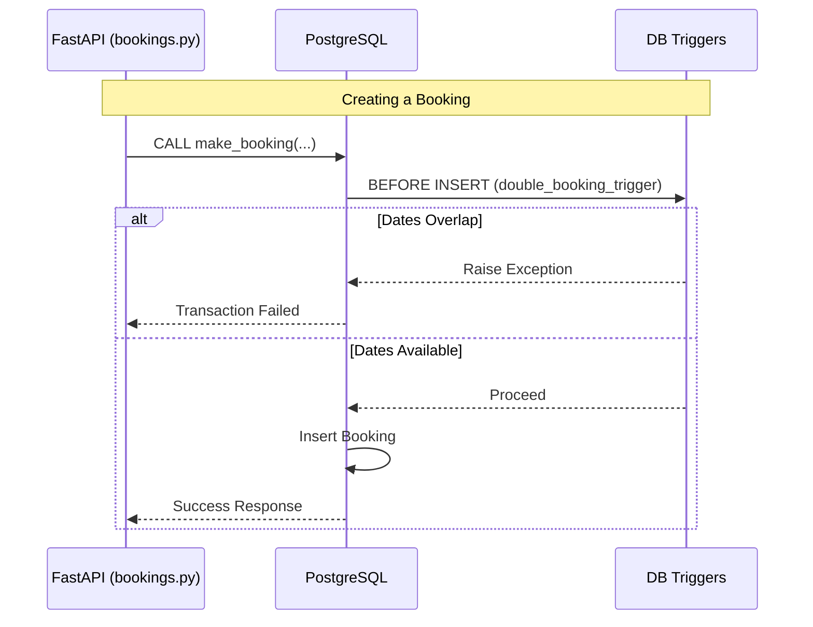

# Member 1 Assignment: Reservation & Front Desk Subsystem

**Role Summary:** You are in charge of the core hotel operations: Making bookings, preventing double bookings, and handling check-ins and check-outs. This involves complex database transactions and triggers to ensure data integrity.

## Your Responsibilities (Files to Edit)

### 1. Database Layer (PostgreSQL)
* `db/procedures/booking.sql`: Write the `make_booking` procedure. It needs to check if the room is available, snapshot the current rate, and insert the booking record inside a transaction.
* `db/procedures/checkin_checkout.sql`: Write `perform_checkin` and `perform_checkout` procedures to update booking status and trigger room status changes.
* `db/triggers/double_booking_trigger.sql`: Write a trigger that prevents a booking from being inserted if the dates overlap with an existing booking for the same room.
* `db/triggers/room_status_trigger.sql`: Write a trigger to automatically update the `room.status` (e.g. to 'Occupied') when a booking status changes.

### 2. Backend Layer (FastAPI Python)
* `backend/app/schemas/booking.py`: Define Pydantic models for booking requests (e.g., `BookingCreate`).
* `backend/app/routers/bookings.py`: Create the API endpoints (`POST /bookings`, `POST /bookings/{id}/check-in`, `POST /bookings/{id}/check-out`) that execute your database procedures.

## Architecture & Flow

