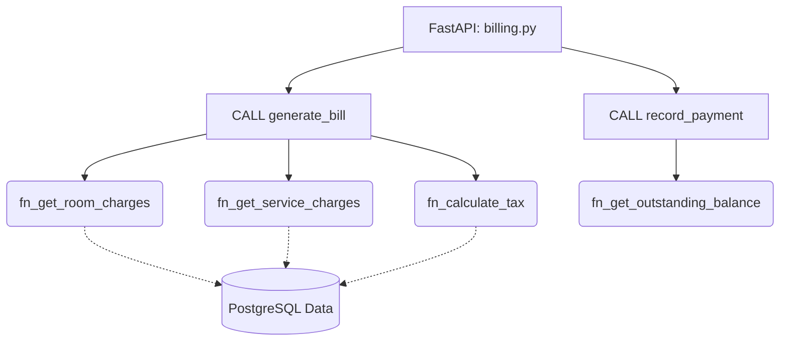

# Member 2 Assignment: Billing & Payments Subsystem

**Role Summary:** You handle the money. Your subsystem calculates how much guests owe based on nights stayed, room rates, and services used. You will write SQL functions for calculations and procedures for recording payments safely.

## Your Responsibilities (Files to Edit)

### 1. Database Layer (PostgreSQL)
* `db/functions/fn_calculate_nights.sql`: Calculate the difference in days between two dates.
* `db/functions/fn_calculate_tax.sql`: Calculate tax amounts based on business rules.
* `db/functions/fn_get_room_charges.sql` & `fn_get_service_charges.sql`: Sum up the charges for a booking.
* `db/functions/fn_get_outstanding_balance.sql`: Calculate `(room + services + tax) - amount_paid`.
* `db/procedures/billing.sql`: Write the `generate_bill` procedure that uses your functions to insert or update a `bill` record.
* `db/procedures/payments.sql`: Write `record_payment` to safely add to `amount_paid` and update the `outstanding_balance`.

### 2. Backend Layer (FastAPI Python)
* `backend/app/schemas/billing.py`: Define Pydantic models for bills and payments.
* `backend/app/routers/billing.py`: Create endpoints like `POST /bills/generate` and `POST /payments` that call your database procedures.

## Architecture & Flow

