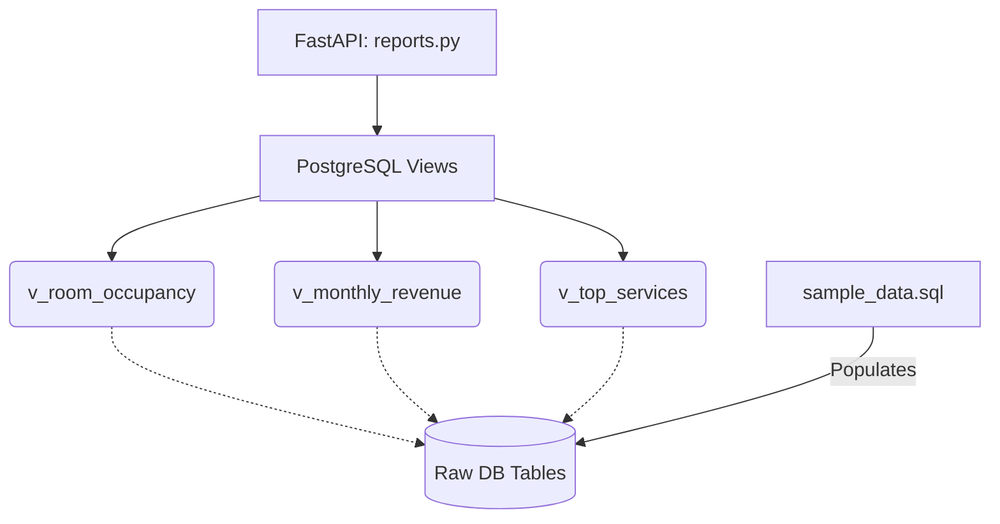

# Member 4 Assignment: Analytics, Views & Seed Data

**Role Summary:** You are the data analyst and quality assurance lead. You will write complex SQL views to generate management reports. You will also create the foundational seed data used by everyone to test their code. 

## Your Responsibilities (Files to Edit)

### 1. Database Layer (PostgreSQL)
* `db/views/reports.sql`: Implement the 5 required analytical views using complex aggregations (GROUP BY, JOINs, Window functions):
  - `v_room_occupancy`: Current occupancy rates.
  - `v_monthly_revenue`: Revenue aggregated by month and branch.
  - `v_guest_billing_summary`: Lifetime value of guests.
  - `v_service_usage_breakdown`: Which services are most popular.
  - `v_top_services`: Ranking of services by revenue.
* `db/seed/sample_data.sql`: Create robust `INSERT` statements for all 13 tables. You must include edge cases (e.g., overlapping dates to test Member 1's trigger, unpaid bills to test Member 2's logic).

### 2. Backend Layer (FastAPI Python)
* `backend/app/routers/reports.py`: Create simple `GET` endpoints that query your views (`SELECT * FROM v_room_occupancy WHERE...`) and return the data as JSON for the frontend dashboard.
* `backend/app/routers/admin.py`: High-level system statistics and audit logs endpoints.

## Architecture & Flow

