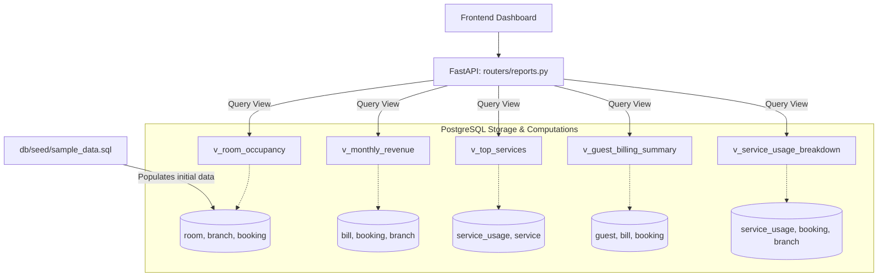

# Member 4 Assignment: Analytics, Views & Seed Data

**Assignee:** Sadeepa  
**Subsystem:** Analytical SQL Views, Seed Data Quality Assurance, Management Reports API, and Admin Management  

> Start by reading the [README](../../../README.md) (Git rules) and [architecture.md](../architecture.md) (how subsystems connect).  
> Reference the [Golden Template Router (rooms.py)](../../../backend/app/routers/rooms.py) before writing your router.  
> Checklist: [todo.md](./todo.md)  
> Specs: [01_database_design](../../specs/01_database_design.md) | [02_api_contract](../../specs/02_api_contract.md) | [05_views_and_reports](../../specs/05_views_and_reports.md) | [07_seed_data](../../specs/07_seed_data.md)

---

## Subsystem Overview & Business Logic

1. **Analytical PostgreSQL Views**: Encapsulate complex multi-table JOINs inside views so the backend can run simple `SELECT * FROM v_room_occupancy WHERE ...` queries.
2. **The 5 Required Management Views**:
   - `v_room_occupancy` — Room occupancy rates by branch and room type.
   - `v_monthly_revenue` — Revenue breakdown by month, year, and branch.
   - `v_guest_billing_summary` — Lifetime spending and unpaid balances per guest.
   - `v_service_usage_breakdown` — Usage volume and revenue by service category.
   - `v_top_services` — Ranked services by total quantity and revenue using `RANK()`.
3. **Seed Data QA**: Ensure 13 tables have realistic, interrelated test data covering edge cases (overlapping dates, partial payments, different booking statuses).
4. **Reports & Admin API**: Expose views through secure endpoints and implement branch/user administration.

---

## Files to Edit & Implementation Steps

```
Phase 1: Database Views & Seed Verification (SQL)  ──►  Phase 2: Reporting Router (FastAPI)  ──►  Phase 3: Admin Router (FastAPI)
- db/views/reports.sql (5 Views)                         - backend/app/routers/reports.py         - backend/app/routers/admin.py
- db/seed/sample_data.sql (QA & edge cases)
```

### Phase 1: Database Layer (PostgreSQL)

Open [reports.sql](../../../db/views/reports.sql) and implement 5 views using `CREATE OR REPLACE VIEW`:

#### 1. `v_room_occupancy`
- **Tables**: `room`, `branch`, `room_type`, `booking` (LEFT JOIN on active reservations).
- **Columns**: `room_id`, `branch_id`, `branch_name`, `room_number`, `type_name`, `capacity`, `room_status`, `booking_id`, `check_in_date`, `check_out_date`, `guest_id`.

#### 2. `v_guest_billing_summary`
- **Tables**: `guest`, `booking`, `bill`, `branch`.
- **Columns**: `guest_id`, `full_name`, `email`, `phone`, `guest_type`, `booking_id`, `branch_name`, `total_amount`, `amount_paid`, `outstanding_balance`, `balance_flag`.

#### 3. `v_service_usage_breakdown`
- **Tables**: `service_usage`, `service`, `booking`, `room`, `branch`.
- **Columns**: `branch_name`, `service_name`, `category`, `total_quantity_used`, `total_revenue_generated`.

#### 4. `v_monthly_revenue`
- **Tables**: `bill`, `booking`, `room`, `branch`.
- **Group by**: `branch_name`, `EXTRACT(YEAR ...)`, `EXTRACT(MONTH ...)`.
- **Columns**: `year`, `month`, `branch_name`, `total_room_revenue`, `total_service_revenue`, `total_tax_collected`, `total_gross_revenue`.

#### 5. `v_top_services`
- **Tables**: `service_usage`, `service`.
- **Window**: `RANK() OVER (ORDER BY SUM(quantity * unit_price) DESC) as revenue_rank`.
- **Columns**: `revenue_rank`, `service_name`, `category`, `total_bookings_ordered`, `total_quantity`, `total_revenue`.

#### 6. [sample_data.sql](../../../db/seed/sample_data.sql)
- Inspect existing 460+ lines of seed data. Ensure bookings, service usages, bills, and payments correctly populate the views with meaningful data.

---

### Phase 2: Reports Router (FastAPI)

#### 7. [routers/reports.py](../../../backend/app/routers/reports.py)
- `GET /api/reports/occupancy` — Params: `branch_id?`, `date?`. Role: `MANAGER/ADMIN`.
- `GET /api/reports/billing-summary` — Params: `branch_id?`, `unpaid_only?`.
- `GET /api/reports/service-usage` — Params: `branch_id?`.
- `GET /api/reports/monthly-revenue` — Params: `year`, `month?`, `branch_id?`.
- `GET /api/reports/top-services` — Params: `limit? (default 10)`.

---

### Phase 3: Admin Router (FastAPI)

#### 8. [routers/admin.py](../../../backend/app/routers/admin.py)
- `GET /api/admin/branches` — List all branches.
- `POST /api/admin/branches` — Add new branch. Role: `ADMIN`.
- `PUT /api/admin/branches/{branch_id}` — Update branch info.
- `GET /api/admin/users` — List all accounts with roles.
- `POST /api/admin/users` — Create staff account (hash password via `auth.hash_password`).
- `PATCH /api/admin/users/{account_id}` — Change role or branch assignment.

---

## Flow Diagram



---

## Testing (Optional — if you set up a local database)

1. **Rebuild**: `psql -U postgres -d skynest -f db/run_all.sql`
2. **Verify views in psql**:
   ```sql
   SELECT branch_name, room_number, type_name, room_status FROM v_room_occupancy LIMIT 5;
   SELECT * FROM v_monthly_revenue;
   SELECT revenue_rank, service_name, total_quantity, total_revenue FROM v_top_services;
   ```
3. **Test API**: Start backend (activate `.venv`, then run `uvicorn app.main:app --reload` in `backend/`), log in as `admin@skynest.lk` / `SkyNest@2026`, authorize in Swagger, test `GET /api/reports/*` and `GET /api/admin/*` at [http://localhost:8000/docs](http://localhost:8000/docs).
