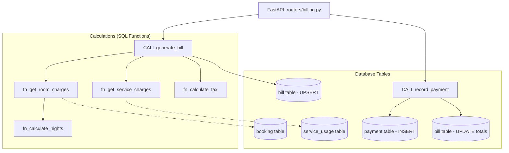

# Member 2 Assignment: Billing & Payments Subsystem

**Assignee:** Sheereen  
**Subsystem:** Rate & Tax Calculation Functions, Bill Generation, and Payment Transactions  

> Start by reading the [README](../../../README.md) (Git rules) and [architecture.md](../architecture.md) (how subsystems connect).  
> Reference the [Golden Template Router (rooms.py)](../../../backend/app/routers/rooms.py) before writing your router.  
> Checklist: [todo.md](./todo.md)  
> Specs: [01_database_design](../../specs/01_database_design.md) | [02_api_contract](../../specs/02_api_contract.md) | [03_stored_procedures](../../specs/03_stored_procedures_functions.md)

---

## Subsystem Overview & Business Logic

1. **Modular SQL Functions** — small, reusable calculations instead of one massive query:
   - `fn_calculate_nights`: Number of nights ($check\_out - check\_in$).
   - `fn_get_room_charges`: Nights × `rate_at_booking`.
   - `fn_get_service_charges`: Sum of $(quantity \times unit\_price)$ from `service_usage`.
   - `fn_calculate_tax`: 10% tax on subtotal.
   - `fn_get_outstanding_balance`: $(total\_amount - amount\_paid)$.
2. **Atomic Bill Generation (`generate_bill`)**: Orchestrates all functions, checks partial payments, then **UPSERT** into `bill` (re-generatable if guest uses another service before checkout).
3. **Recording Payments (`record_payment`)**: Validates bill exists, inserts into `payment`, atomically updates `bill.amount_paid`, `outstanding_balance`, and `balance_flag`.

---

## Files to Edit & Implementation Steps

```
Phase 1: Database Functions & Procedures (SQL)  ──►  Phase 2: Backend Schemas (Pydantic)  ──►  Phase 3: Backend Routers (FastAPI)
- fn_calculate_nights.sql                            - schemas/billing.py                       - routers/billing.py
- fn_calculate_tax.sql
- fn_get_room_charges.sql
- fn_get_service_charges.sql
- fn_get_outstanding_balance.sql
- billing.sql (generate_bill)
- payments.sql (record_payment)
```

### Phase 1: Database Layer (PostgreSQL)

#### 1. [fn_calculate_nights.sql](../../../db/functions/fn_calculate_nights.sql)
- **Signature**: `fn_calculate_nights(p_check_in DATE, p_check_out DATE) RETURNS INTEGER`
- If `p_check_out <= p_check_in` → return `1` (minimum 1 night). Otherwise → `RETURN (p_check_out - p_check_in)`.

#### 2. [fn_calculate_tax.sql](../../../db/functions/fn_calculate_tax.sql)
- **Signature**: `fn_calculate_tax(p_amount NUMERIC(10,2)) RETURNS NUMERIC(10,2)`
- `RETURN ROUND(p_amount * 0.10, 2);` (10% tax)

#### 3. [fn_get_room_charges.sql](../../../db/functions/fn_get_room_charges.sql)
- **Signature**: `fn_get_room_charges(p_booking_id UUID) RETURNS NUMERIC(10,2)`
- Get `check_in_date`, `check_out_date`, `rate_at_booking` from `booking`. Calculate nights via `fn_calculate_nights`. Return `ROUND(nights * rate, 2)`.

#### 4. [fn_get_service_charges.sql](../../../db/functions/fn_get_service_charges.sql)
- **Signature**: `fn_get_service_charges(p_booking_id UUID) RETURNS NUMERIC(10,2)`
- `SELECT COALESCE(SUM(quantity * unit_price), 0.00) FROM service_usage WHERE booking_id = p_booking_id;`

#### 5. [fn_get_outstanding_balance.sql](../../../db/functions/fn_get_outstanding_balance.sql)
- **Signature**: `fn_get_outstanding_balance(p_booking_id UUID) RETURNS NUMERIC(10,2)`
- Get `total_amount` and `amount_paid` from `bill`. Return `GREATEST(total_amount - amount_paid, 0.00)`.

#### 6. [billing.sql](../../../db/procedures/billing.sql)
- **Procedure**: `generate_bill(p_booking_id UUID, p_discount_amount NUMERIC(10,2) DEFAULT 0.00)`
- **Logic**:
  1. `v_room_charges := fn_get_room_charges(p_booking_id);`
  2. `v_service_charges := fn_get_service_charges(p_booking_id);`
  3. `v_subtotal := v_room_charges + v_service_charges - p_discount_amount;`
  4. `v_tax_amount := fn_calculate_tax(v_subtotal);`
  5. `v_total := v_subtotal + v_tax_amount;`
  6. Read cumulative payments: `SELECT COALESCE(SUM(amount), 0.00) INTO v_amount_paid FROM payment WHERE booking_id = p_booking_id;`
  7. `v_outstanding := GREATEST(v_total - v_amount_paid, 0.00);`
  8. UPSERT into `bill`:
     ```sql
     INSERT INTO bill (booking_id, room_charges, service_charges, discount_amount,
         tax_amount, total_amount, amount_paid, outstanding_balance, balance_flag, generated_at)
     VALUES (...)
     ON CONFLICT (booking_id) DO UPDATE SET
         room_charges = EXCLUDED.room_charges, service_charges = EXCLUDED.service_charges,
         discount_amount = EXCLUDED.discount_amount, tax_amount = EXCLUDED.tax_amount,
         total_amount = EXCLUDED.total_amount, amount_paid = EXCLUDED.amount_paid,
         outstanding_balance = EXCLUDED.outstanding_balance, balance_flag = EXCLUDED.balance_flag,
         generated_at = NOW();
     ```

#### 7. [payments.sql](../../../db/procedures/payments.sql)
- **Procedure**: `record_payment(p_booking_id UUID, p_amount NUMERIC(10,2), p_payment_method VARCHAR(50), p_notes VARCHAR(255) DEFAULT NULL)`
- **Logic**:
  1. Validate bill exists, else `RAISE EXCEPTION 'No bill found for booking'`.
  2. `INSERT INTO payment (booking_id, amount, payment_method, notes, paid_at) VALUES (...);`
  3. Recalculate `v_new_paid` from `SUM(amount)`, `v_outstanding := GREATEST(total - v_new_paid, 0.00)`.
  4. Update `bill SET amount_paid, outstanding_balance, balance_flag`.

---

### Phase 2: Backend Schemas (Pydantic)

#### 8. [schemas/billing.py](../../../backend/app/schemas/billing.py)
- `BillOut`: All bill fields (`bill_id`, `booking_id`, charges, tax, totals, `balance_flag`, `generated_at`). Config: `from_attributes = True`.
- `PaymentCreate`: `booking_id`, `amount` (validate `> 0`), `payment_method`, `notes?`.
- `PaymentOut`: `payment_id`, `booking_id`, `amount`, `payment_method`, `paid_at`, `notes?`. Config: `from_attributes = True`.

---

### Phase 3: Backend Routers (FastAPI)

#### 9. [routers/billing.py](../../../backend/app/routers/billing.py)
- `POST /api/billing/{booking_id}/generate` — Calls `CALL generate_bill(...)`, returns `BillOut`. Role: `RECEPTIONIST/MANAGER/ADMIN`.
- `GET /api/billing/{booking_id}` — Fetches bill, returns `BillOut`.
- `POST /api/payments` — Calls `CALL record_payment(...)`, returns `201 Created` with `PaymentOut`.
- `GET /api/payments/{booking_id}` — All payments for a booking, ordered by `paid_at DESC`.

---

## Flow Diagram



---

## Testing (Optional — if you set up a local database)

1. **Rebuild**: `psql -U postgres -d skynest -f db/run_all.sql`
2. **Test functions in psql**:
   ```sql
   SELECT fn_calculate_nights('2026-10-01'::DATE, '2026-10-05'::DATE); -- Should return 4
   SELECT fn_calculate_tax(100.00);                                     -- Should return 10.00
   ```
3. **Test procedures in psql**:
   ```sql
   CALL generate_bill('e0000000-0000-0000-0000-000000000001');
   SELECT * FROM bill WHERE booking_id = 'e0000000-0000-0000-0000-000000000001';

   CALL record_payment('e0000000-0000-0000-0000-000000000001', 50.00, 'Cash', 'Advance deposit');
   SELECT total_amount, amount_paid, outstanding_balance, balance_flag
   FROM bill WHERE booking_id = 'e0000000-0000-0000-0000-000000000001';
   ```
4. **Test API**: Start backend (activate `.venv`, then run `uvicorn app.main:app --reload` in `backend/`), open [http://localhost:8000/docs](http://localhost:8000/docs).
