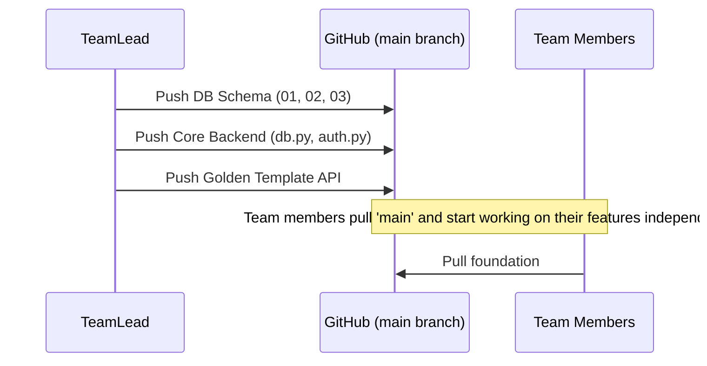

# Team Lead Assignment: Core Infrastructure & Golden Template

**Role Summary:** You are the architect. You build the foundational database schema and the core backend engine. Without your work, the team cannot start. You will also build the Authentication system and one "Golden Template" API route so the team can learn from your code.

## Your Responsibilities (Files to Edit)

### 1. Database Foundation
These must be done first and pushed to `main`:
* `db/schema/01_tables.sql`: Define all enums and 13 tables.
* `db/schema/02_constraints.sql`: Define FKs, CHECK, and UNIQUE constraints.
* `db/schema/03_indexes.sql`: Define indexes for optimization.
* `db/run_all.sql`: Ensure the script runs perfectly to rebuild the database.

### 2. Backend Infrastructure & Auth
* `backend/app/config.py`: Environment variable loading.
* `backend/app/db.py`: Setup the `asyncpg` connection pool.
* `backend/app/auth.py`: JWT token creation, verification, and bcrypt hashing.
* `backend/app/dependencies.py`: `get_db`, `get_current_user`, `require_role`.
* `backend/app/main.py`: FastAPI app initialization and router mounting.

### 3. Golden Template API
* `backend/app/routers/auth.py`: Login endpoints.
* `backend/app/routers/rooms.py` (or similar): Build one complete CRUD router with Pydantic schemas to act as a reference for your team.

## Architecture & Flow

