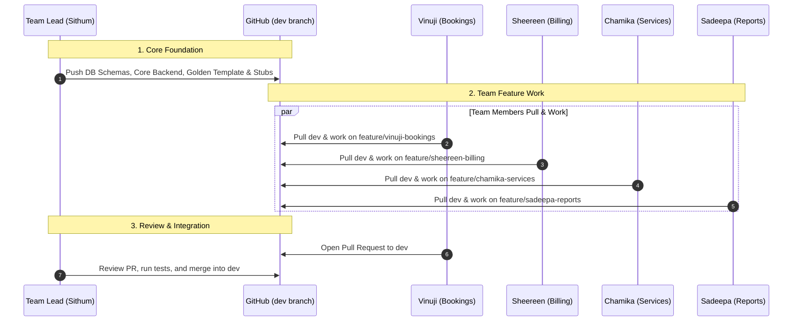

# Team Lead Assignment: Core Infrastructure & Golden Template

**Assignee:** Sithum (Team Lead & System Architect)  
**Subsystem:** Database DDL Schema, Connection Engine, Authentication/JWT Security, and Golden Reference Router  

> Guides: [README](../../../README.md) | [architecture.md](../architecture.md) | [learn.md](../learn.md) | [todo.md](./todo.md)  
> Specs: [01_database_design](../../specs/01_database_design.md) | [02_api_contract](../../specs/02_api_contract.md) | [06_indexing_strategy](../../specs/06_indexing_strategy.md) | [08_auth_and_roles](../../specs/08_auth_and_roles.md)

---

## Subsystem Overview & Responsibilities

Your job is to build the foundation that unblocks the entire team:

1. **Database Schema Foundation**: All ENUMs and 13 tables, FK/CHECK/UNIQUE constraints, B-Tree indexes, and the master rebuild script `run_all.sql`.
2. **Backend Engine & Security**: Environment config, `asyncpg` connection pool, `bcrypt` password hashing, JWT token handling, and role-based access control dependencies.
3. **Golden Reference Template**: A complete, production-grade CRUD router at `rooms.py` with comprehensive comments — the learning blueprint for teammates.
4. **Team Coordination & PR Reviews**: Protect `main`/`dev` branches, review incoming PRs.

---

## Files & Architecture Breakdown

### 1. Database Foundation (PostgreSQL)

- [01_tables.sql](../../../db/schema/01_tables.sql): ENUM types + 13 tables (`branch`, `room_type`, `amenity`, `room_amenity`, `room_rate`, `room`, `guest`, `user_account`, `service`, `booking`, `service_usage`, `bill`, `payment`).
- [02_constraints.sql](../../../db/schema/02_constraints.sql): FKs, CHECK constraints, composite UNIQUE rules.
- [03_indexes.sql](../../../db/schema/03_indexes.sql): B-Tree indexes on FKs and high-frequency columns.
- [run_all.sql](../../../db/run_all.sql): Master entry script, strict dependency order.

### 2. Backend Infrastructure (Python FastAPI)

- [config.py](../../../backend/app/config.py): Loads/validates env settings via Pydantic `BaseSettings`.
- [db.py](../../../backend/app/db.py): `asyncpg.Pool` lifecycle, `get_db()` and `get_connection()` context managers.
- [auth.py](../../../backend/app/auth.py): `bcrypt` hashing + `pyjwt` token creation/verification.
- [dependencies.py](../../../backend/app/dependencies.py): `get_current_user` (Bearer token → user), `require_role(*roles)` (RBAC guard).
- [main.py](../../../backend/app/main.py): FastAPI init, CORS middleware, lifespan handler, router mounting.

### 3. Golden Reference & Auth Router

- [auth.py (Router)](../../../backend/app/routers/auth.py): `POST /api/auth/login`, `POST /api/auth/register`, `GET /api/auth/me`.
- [rooms.py (Golden Template)](../../../backend/app/routers/rooms.py): Fully commented reference — query execution, param binding, role auth, Pydantic validation, error handling. Endpoints: `GET/POST/PUT/PATCH/DELETE /api/rooms`.

---

## Team Workflow



---

## PR Review Checklist

When reviewing teammate PRs:
1. **Schema Integrity**: Does `db/run_all.sql` execute cleanly? Consistent snake_case naming?
2. **ACID & Exceptions**: Proper transactions? `RAISE EXCEPTION` for business rule violations?
3. **Pydantic**: Correct types (`UUID`, `date`, `float`)? `from_attributes = True` on response models?
4. **Security**: `Depends(require_role(...))` on sensitive endpoints? Parameterized queries (`$1, $2`)?
5. **Comments**: Docstrings and explanatory comments preserved?

---

## Quick Commands

```bash
psql -U postgres -d skynest -f db/run_all.sql         # Rebuild database
cd backend && .venv\Scripts\activate && uvicorn app.main:app --reload  # Start backend (.venv)
cd frontend && npm run dev                              # Start frontend
```
