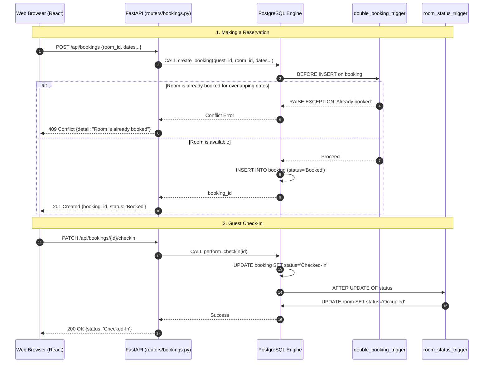

# Member 1 Assignment: Reservation & Front Desk Subsystem

**Assignee:** Vinuji  
**Subsystem:** Room Bookings, Guest Check-In / Check-Out, and Double-Booking Prevention  

> Start by reading the [README](../../README.md) (Git rules) and [architecture.md](./architecture.md) (how subsystems connect).  
> Reference the [Golden Template Router (rooms.py)](../../backend/app/routers/rooms.py) before writing your router.  
> Specs: [01_database_design](../specs/01_database_design.md) | [02_api_contract](../specs/02_api_contract.md) | [03_stored_procedures](../specs/03_stored_procedures_functions.md) | [04_triggers](../specs/04_triggers.md)

---

## Subsystem Overview & Business Logic

1. **Making a Reservation (`create_booking`)**: Guest/receptionist requests a room for a date range. System checks availability, rejects if already booked, otherwise snapshots the current daily rate into `rate_at_booking` (price is locked even if rates change later).
2. **Preventing Double Bookings (`double_booking_trigger`)**: A `BEFORE INSERT` trigger ensures no two bookings overlap for the same room. Overlap condition: `existing.check_in_date < new.check_out_date AND existing.check_out_date > new.check_in_date`. Fires `RAISE EXCEPTION` if violated.
3. **Guest Check-In (`perform_checkin`)**: Transitions `booking.status` from `'Booked'` → `'Checked-In'`, sets `actual_checkin_time = NOW()`, and updates `room.status = 'Occupied'`.
4. **Guest Check-Out (`perform_checkout`)**: Transitions `booking.status` to `'Checked-Out'`, sets `actual_checkout_time = NOW()`, and updates `room.status = 'Available'`.

---

## Files to Edit & Implementation Steps

```
Phase 1: Database Logic (SQL)  ──►  Phase 2: Backend Schemas (Pydantic)  ──►  Phase 3: Backend Routers (FastAPI)
- double_booking_trigger.sql       - schemas/booking.py                       - routers/bookings.py
- booking.sql (create_booking)
- checkin_checkout.sql
- room_status_trigger.sql
```

### Phase 1: Database Layer (PostgreSQL)

#### 1. [double_booking_trigger.sql](../../db/triggers/double_booking_trigger.sql)
- **Trigger**: `BEFORE INSERT ON booking FOR EACH ROW`
- **Function**: `trg_check_double_booking()` — query for overlapping active bookings (`status NOT IN ('Cancelled', 'Checked-Out')`). If found, `RAISE EXCEPTION`. Otherwise, `RETURN NEW`.
- **Trigger definition**:
  ```sql
  CREATE TRIGGER trg_double_booking
  BEFORE INSERT ON booking FOR EACH ROW
  EXECUTE FUNCTION trg_check_double_booking();
  ```

#### 2. [booking.sql](../../db/procedures/booking.sql)
- **Procedure**: `create_booking(p_guest_id UUID, p_room_id UUID, p_check_in_date DATE, p_check_out_date DATE, p_payment_option VARCHAR(50), OUT p_booking_id UUID)`
- **Logic**:
  1. Get `branch_id` and `room_type_id` from `room` table.
  2. Snapshot rate: `v_rate := fn_get_current_rate(v_branch_id, v_room_type_id);`
  3. `INSERT INTO booking (...) VALUES (...) RETURNING booking_id INTO p_booking_id;`
  4. If dates overlap, `double_booking_trigger` aborts automatically.

#### 3. [checkin_checkout.sql](../../db/procedures/checkin_checkout.sql)
- `perform_checkin(p_booking_id UUID)`:
  - Validate `status == 'Booked'`, else `RAISE EXCEPTION`.
  - Update `booking SET status = 'Checked-In', actual_checkin_time = NOW()`.
  - Update `room SET status = 'Occupied'`.
- `perform_checkout(p_booking_id UUID)`:
  - Validate `status == 'Checked-In'`, else `RAISE EXCEPTION`.
  - Update `booking SET status = 'Checked-Out', actual_checkout_time = NOW()`.
  - Update `room SET status = 'Available'`.

#### 4. [room_status_trigger.sql](../../db/triggers/room_status_trigger.sql)
- **Trigger**: `AFTER UPDATE OF status ON booking FOR EACH ROW`
- **Function**: `trg_sync_room_status()` — if `NEW.status = 'Checked-In'`, set room to `'Occupied'`. If `NEW.status IN ('Checked-Out', 'Cancelled')`, check no other active booking holds the room, then set `'Available'`.

---

### Phase 2: Backend Schemas (Pydantic)

#### 5. [schemas/booking.py](../../backend/app/schemas/booking.py)
- `BookingCreate`: `guest_id`, `room_id`, `check_in_date`, `check_out_date`, `payment_option`. Validator: `check_out_date > check_in_date`.
- `BookingStatusUpdate`: `reason: str | None = None`
- `BookingOut`: All booking fields + `actual_checkin_time`, `actual_checkout_time`. Config: `from_attributes = True`.

---

### Phase 3: Backend Routers (FastAPI)

#### 6. [routers/bookings.py](../../backend/app/routers/bookings.py)
- `POST /api/bookings` — Calls `CALL create_booking(...)`. Catch overlap → `409 Conflict`. Return `201 Created`.
- `GET /api/bookings` — Paginated list with filters (`status`, `guest_id`, `room_id`, `branch_id`).
- `GET /api/bookings/{booking_id}` — Detailed booking info.
- `PATCH /api/bookings/{booking_id}/checkin` — Role: `RECEPTIONIST/MANAGER/ADMIN`. Calls `CALL perform_checkin(:id)`.
- `PATCH /api/bookings/{booking_id}/checkout` — Role: `RECEPTIONIST/MANAGER/ADMIN`. Calls `CALL perform_checkout(:id)`.
- `PATCH /api/bookings/{booking_id}/cancel` — Updates status to `'Cancelled'`.

---

## Flow Diagram



---

## Testing (Optional — if you set up a local database)

1. **Rebuild**: `psql -U postgres -d skynest -f db/run_all.sql`
2. **Test trigger in psql**:
   ```sql
   -- First booking (should succeed):
   INSERT INTO booking (guest_id, room_id, check_in_date, check_out_date, rate_at_booking, payment_option, status)
   VALUES ('c0000000-0000-0000-0000-000000000001', 'd0000000-0000-0000-0000-000000000001', '2026-11-01', '2026-11-05', 120.00, 'CreditCard', 'Booked');

   -- Overlapping booking (MUST fail):
   INSERT INTO booking (guest_id, room_id, check_in_date, check_out_date, rate_at_booking, payment_option, status)
   VALUES ('c0000000-0000-0000-0000-000000000002', 'd0000000-0000-0000-0000-000000000001', '2026-11-03', '2026-11-07', 120.00, 'CreditCard', 'Booked');
   ```
3. **Test API**: Start backend (activate `.venv`, then run `uvicorn app.main:app --reload` in `backend/`), open [http://localhost:8000/docs](http://localhost:8000/docs).
